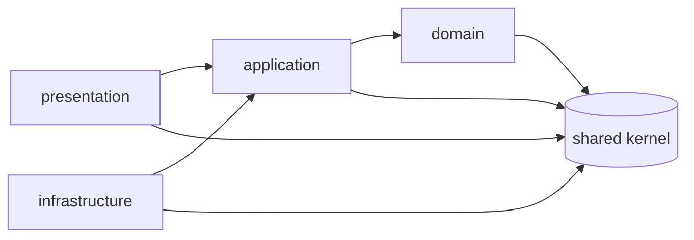

# Arquitectura de VitrinIA

Fuente de las definiciones: [`VITRINIA.md`](../VITRINIA.md) §6–§8. Este documento aterriza esas definiciones en el código y se actualiza con cada PR que toque arquitectura (DoD #9). Cada módulo tendrá su propia página en `modulos/`.

## 1. Vista general

- Una sola app Next.js (App Router) en TypeScript `strict`. Monolito modular con Clean Architecture completa en todos los módulos (ADR-0001).
- Capas por módulo: `domain` → `application` → `infrastructure` / `presentation`. Las dependencias apuntan hacia adentro; el dominio no importa nada externo.
- Multi-tenant por host con triple aislamiento (ADR-0003). Todo caso de uso recibe un `StoreId` del shared kernel.
- Composition root: `src/infra/container.ts` (pendiente; lo crea el módulo que primero lo necesite). Es el único archivo que puede importar `infrastructure/` de varios módulos (§3.2).
- La regla de dependencia la verifica una máquina, no una convención: `pnpm arch` (dependency-cruiser, §3) falla en cuanto un import cruza una capa o un módulo.



## 2. Shared kernel (`src/shared/kernel/`)

Archivo protegido: solo lo modifica el Architect (AGENTS.md §5). Contiene los tipos base que usan todos los módulos. No importa nada fuera de su carpeta (ni Next, ni Zod, ni Drizzle): es TypeScript puro y se puede ejecutar en cualquier runtime.

Se importa desde el barrel: `import { Money, StoreId, Result } from "@/shared/kernel"`.

| Archivo | Exporta | Para qué |
|---|---|---|
| `result.ts` | `Result<T,E>`, `Ok<T>`, `Err<E>`, `Result.ok/err/isOk/isErr/map/mapErr/andThen/unwrapOr/match/all` | Éxito o fallo explícito, sin excepciones |
| `errors.ts` | `DomainError<Code>`, `domainError()`, `isDomainError()` | Errores de dominio tipados y serializables |
| `money.ts` | `Money`, `Currency`, `CURRENCIES`, `InvalidMoney`, `CurrencyMismatch`, `MoneyError` | Dinero como entero + moneda |
| `store-id.ts` | `StoreId`, `InvalidStoreId` | Identificador de tienda (tenant) con marca de tipo |
| `uuid.ts` | `isUuidV7()` | Validación de UUID v7 reutilizable por otros IDs |

### 2.1 `Result<T, E>`

Unión discriminada `{ ok: true, value } | { ok: false, error }`, congelada con `Object.freeze`. Los casos de uso devuelven `Result` y nunca lanzan excepciones por errores de negocio; las excepciones quedan reservadas para fallos de infraestructura (red, base de datos caída) y se capturan en los adaptadores.

```ts
const total = Result.andThen(price.multiply(qty), (line) => subtotal.add(line));
return Result.match(total, {
  ok: (money) => ({ total: money.toJSON() }),
  err: (error) => ({ error: error.code }),
});
```

- `Result.all([...])` acumula una lista y corta en el primer error (validaciones de carrito, importaciones). Con una tupla literal conserva los tipos por posición: `Result.all([priceResult, idResult])` es `Result<readonly [Money, StoreId], InvalidMoney | InvalidStoreId>`; con un array homogéneo devuelve `Result<ReadonlyArray<T>, E>`.
- Se narrowea con `if (!result.ok) return result;` o con `Result.isOk` / `Result.isErr`.

### 2.2 Errores de dominio

Un `DomainError<Code>` es un objeto plano y congelado con `code` (literal, sirve de discriminante en `switch`) y `message` (en inglés, sin datos personales ni entradas del usuario). **No extiende `Error` ni se lanza**: viaja dentro de `Result.err(...)`, cruza server actions sin perder tipo y se puede loggear sin exponer stack traces.

Cada módulo define sus errores extendiendo el tipo con campos propios y una fábrica:

```ts
export type ProductNotFound = DomainError<"ProductNotFound"> & { readonly productId: string };
```

`isDomainError(value)` permite distinguir en los bordes un error de dominio de una excepción inesperada. La heurística es estricta: solo acepta objetos planos (prototipo `Object.prototype` o `null`), nunca instancias de `Error` ni de otras clases, con `code` string no vacío y `message` string. Así un `Error` de Node con `code: "ECONNREFUSED"` no se confunde con un error de negocio.

### 2.3 `Money`

Decisiones (VITRINIA.md §7, pre-mortem: "diseñar Money con float"):

- `amount` es un **entero seguro** (`Number.isSafeInteger`) en la unidad mínima de la moneda. `CLP` no tiene unidad mínima: `Money.of(1990, "CLP")` son $1.990. `CURRENCIES` registra `minorUnits` por moneda para que agregar una con decimales (si algún día hace falta) no cambie la representación.
- `Money.of(amount, currency)` acepta `currency: string` porque es la puerta de entrada desde filas de base de datos, formularios y JSON; valida y devuelve `Result<Money, InvalidMoney>` con `reason` en `NotAnInteger | OutOfRange | UnknownCurrency`.
- `add`, `subtract` devuelven `Result<Money, MoneyError>`: `CurrencyMismatch` si las monedas difieren (nunca una excepción) e `InvalidMoney` (`OutOfRange`) si el resultado sale del rango seguro.
- `multiply(factor)` solo acepta factores enteros (cantidades). No existe división ni porcentaje en el kernel: el redondeo es una regla de negocio que decidirá el módulo que lo necesite (descuentos, comisiones) con su propio ADR.
- Es inmutable (`Object.freeze`) y el signo está permitido: un `Money` negativo es válido (reembolsos, líneas de ledger). La regla "un precio no es negativo" pertenece al value object `Price` del módulo `catalog`, fuera de este issue.
- `toJSON()` devuelve `{ amount, currency }` y `Money.of` lo vuelve a leer: ese es el contrato de persistencia (columnas `amount bigint` + `currency`) y de transporte. En Postgres `amount` es **`bigint`**, no `integer`: un monto CLP individual cabe en `int4`, pero las sumas y agregados (`SUM(amount)` de ventas, ledger) lo desbordan con facilidad. Drizzle lo declara como `bigint("amount", { mode: "number" })` para que siga llegando a `Money.of` como `number`; `Number.isSafeInteger` (2^53) es el límite real y `OutOfRange` lo protege.
- `-0` se normaliza a `0` en toda construcción: `Money.of(-0, "CLP")` y `subtract` nunca producen un `-0` que rompa `Object.is`, la serialización o las comparaciones.
- Formatear como `$1.990` es responsabilidad de la presentación (`Intl.NumberFormat("es-CL")`), no del kernel.

### 2.4 `StoreId`

- Tipo marcado (`string & { [brand]: "StoreId" }`): un `string` suelto no compila donde se espera `StoreId`. Es la pieza que hace verificable la regla "todo caso de uso recibe y comprueba el `StoreId`" (ADR-0003 §5).
- Única forma de obtenerlo: `StoreId.parse(input: unknown)`. Acepta `unknown` para usarse directo en los bordes (sesión, host resuelto, parámetros) y devuelve `Result<StoreId, InvalidStoreId>` si no es un UUID v7 canónico.
- Normaliza a minúsculas para que la igualdad y la comparación en RLS (`app.store_id`) sean canónicas. `StoreId.equals(a, b)` compara por valor.
- El mensaje de `InvalidStoreId` no incluye la entrada recibida: puede venir de un atacante y terminaría en logs.
- La **generación** de IDs no está en el kernel: la hará un puerto `IdGenerator` en infraestructura (Node 22 no trae UUID v7 nativo). Los demás IDs (`ProductId`, `OrderId`...) seguirán el mismo patrón reutilizando `isUuidV7`.
- **Nunca `gen_random_uuid()` en Postgres** como `DEFAULT` de una columna de ID: genera UUID v4, que `isUuidV7` rechaza (nibble de versión distinto) y que no ordena por tiempo. Los IDs se generan en la aplicación con el `IdGenerator` y la columna no lleva default; `uuidv7()` nativo de Postgres 18 queda como opción futura cuando Supabase lo exponga.

### 2.5 Reglas para quien usa el kernel

1. Nunca `throw` por un error de negocio: devuelve `Result.err(domainError(...))`.
2. Nunca `number` con decimales para dinero: `Money` o nada. Los esquemas Drizzle usan `bigint` (`mode: "number"`) + `currency`; nunca `integer` ni `numeric`.
3. Nunca `string` para identificar una tienda en dominio o aplicación: `StoreId`.
4. El kernel no crece por conveniencia. Un tipo entra solo si lo usan dos o más módulos y lo aprueba el Architect; lo específico de un módulo vive en su `domain/`.

### 2.6 Verificación

- Tests colocados junto al código (`*.test.ts`) con Vitest; `pnpm test` y `pnpm test:coverage`.
- Umbral de cobertura del 90 % (líneas, ramas, funciones, sentencias) sobre `src/shared/**` y `src/modules/**/{domain,application}/**`, configurado en `vitest.config.mts`. El kernel está al 100 %.
- La regla "el kernel no importa nada externo" la verifica dependency-cruiser (`kernel-is-self-contained`, §3.2).

## 3. Reglas de dependencia (`pnpm arch`)

Herramienta: [dependency-cruiser](https://github.com/sverweij/dependency-cruiser), configurada en `.dependency-cruiser.cjs` (ADR-0008). Lee los imports de `src/` con el compilador de TypeScript (`tsPreCompilationDeps: true`, por eso TypeScript está fijado a `6.0.3`), así que **los imports solo de tipos también cuentan**: `import type { z } from "zod"` en `domain/` es una violación. Los archivos `*.test.ts` quedan fuera del análisis (pueden importar Vitest); lo demás, incluido `src/app/` y `src/middleware.ts`, se analiza entero.

| Comando | Qué hace | Resultado esperado |
|---|---|---|
| `pnpm arch` | Analiza `src/` con todas las reglas | Código 0 y `no dependency violations found`. Es lo que ejecuta CI (VIT-105). |
| `pnpm arch:fixtures` | Analiza el árbol falso `tests/arch-fixtures/` | Código distinto de 0: lista una violación por regla. |
| `pnpm test` | Incluye `tests/arch/rules.test.ts` | Afirma que cada regla tiene un fixture que la dispara y que `src/` está limpio. |
| `pnpm arch:graph` | Regenera [`dependencias.mmd`](dependencias.mmd) (Mermaid) | Se commitea junto con cambios de estructura. |

Al fallar, la salida nombra la regla, el archivo origen y el destino:

```
error domain-is-pure: src/modules/catalog/domain/product.ts → drizzle-orm
```

Todas las reglas tienen `severity: "error"`. **No existe `warn`**: una regla que no bloquea no protege nada.

### 3.1 Mapa de quién puede importar a quién

| Desde ↓ / hacia → | `domain/` propio | `application/` propio | `infrastructure/` propio | `presentation/` propio | otro módulo | `shared/kernel` | `src/infra/container.ts` | resto de `src/infra/` | paquetes npm / `node:*` |
|---|---|---|---|---|---|---|---|---|---|
| `domain/` | sí | no | no | no | no | sí | no | no | **no** |
| `application/` | sí | sí | no | no | solo `application/index.ts` | sí | no | no | **no** |
| `infrastructure/` | sí | sí | sí | no | solo `application/index.ts` | sí | no | sí (`db/with-store-tx`, nunca `db/client`) | sí |
| `presentation/` | sí | sí | no | sí | solo `application/index.ts` | sí | sí | no | sí |
| `src/app/` | no | sí | no | sí | — | sí | sí | no | sí |
| `src/shared/` | — | — | — | — | no | sí | no | no | kernel: no; resto: sí |
| `src/infra/` | — | sí (`container.ts` cablea casos de uso) | sí (solo `container.ts`) | — | — | sí | sí | sí | sí |

### 3.2 Las reglas, una por una

Cada nombre es el que aparece en la salida de `pnpm arch` y en `.dependency-cruiser.cjs`. Entre paréntesis, el fixture que la demuestra en `tests/arch-fixtures/src/`.

**Capas (VITRINIA.md §6.2)**

- `domain-is-pure` — `domain/` solo importa su propio `domain/` y `src/shared/kernel`. Nada de npm, nada de `node:*`, nada de `application/`. Es la regla que hace que una entidad se pueda testear sin levantar nada (`modules/catalog/domain/violates-domain-is-pure-*.ts`: Drizzle, tipo de Next, application).
- `application-only-domain-and-kernel` — `application/` (casos de uso y puertos) solo importa su `application/`, su `domain/`, el kernel y el `application/index.ts` de otros módulos. Un caso de uso que necesita UUIDs, reloj o red define un puerto; el adaptador va en `infrastructure/` (`modules/catalog/application/violates-application-*.ts`).
- `presentation-not-to-infrastructure` — server actions, route handlers y tools MCP llaman casos de uso; obtienen los adaptadores ya cableados desde `src/infra/container.ts` (`modules/catalog/presentation/violates-presentation-infrastructure.ts`).
- `infrastructure-not-to-presentation` — un adaptador implementa un puerto; nunca sabe quién lo llama (`modules/catalog/infrastructure/violates-infrastructure-presentation.ts`).

**Entre módulos**

- `no-cross-module-internals` — desde `src/modules/A/` solo se puede importar `src/modules/B/application/index.ts`. `domain/`, `infrastructure/`, `presentation/` y los archivos sueltos de `application/` de otro módulo son privados. Lo que otro módulo necesita se exporta desde el barrel (`modules/orders/*/violates-cross-module-*.ts`: infrastructure, domain y un caso de uso suelto).

**Shared kernel (§2)**

- `kernel-is-self-contained` — `src/shared/kernel/` no importa nada fuera de su carpeta: ni paquetes, ni `node:*`, ni módulos (`shared/kernel/violates-kernel-*.ts`).
- `shared-not-to-app-code` — nada en `src/shared/` importa `src/modules/`, `src/infra/` ni `src/app/`. Si algo "compartido" necesita un módulo, no es compartido: es de ese módulo (`shared/utils/violates-shared-to-infra.ts`).

**Composition root y Next.js**

- `infrastructure-only-wired-in-container` — el `infrastructure/` de un módulo lo importa su propio `infrastructure/` o `src/infra/container.ts`. Nadie más instancia adaptadores (`app/(portal)/violates-app-infrastructure.ts`).
- `app-only-presentation-and-application` — `src/app/` (rutas y layouts; `middleware.ts` vive en la raíz de `src/`) importa `presentation/` y `application/`; nunca `domain/` ni `infrastructure/` (`app/(portal)/violates-app-domain.ts`).
- `platform-infra-only-from-adapters` — `src/infra/` (cliente de base de datos, `withStoreTx`, adaptadores de plataforma) solo es alcanzable desde `infrastructure/` de módulos y desde el propio `src/infra/`. La única excepción es `src/infra/container.ts`, que `presentation/` y `src/app/` pueden importar para obtener los casos de uso cableados; y los puntos de entrada de Next.js en la raíz de `src/` (`instrumentation.ts`, `middleware.ts`, `proxy.ts`), que arrancan el proceso y pueden importar código de plataforma como `src/infra/env.ts` o `src/infra/security/`, pero no la base de datos (eso lo sigue bloqueando `drizzle-only-in-infrastructure`; control positivo `src/instrumentation.ts`) (`modules/catalog/presentation/violates-platform-infra-from-presentation.ts`).

**Tenancy (ADR-0003 §4; threat model de tenancy C3 y brecha G6)**

- `drizzle-only-in-infrastructure` — `drizzle-orm`, el driver (`postgres` / `pg`) y `src/infra/db/` solo se importan desde `infrastructure/` de un módulo o desde `src/infra/`. Un caso de uso, una server action o una ruta que toque la base de datos directamente se salta `withStoreTx` y por tanto el `SET LOCAL app.store_id`: RLS devolvería cero filas o, peor, se consultaría sin contexto de tienda (`modules/catalog/domain/violates-domain-is-pure-drizzle.ts`, `modules/catalog/application/violates-drizzle-in-application.ts`, `app/(portal)/violates-drizzle-in-app.ts`).
- `db-client-only-via-with-store-tx` — la conexión cruda `src/infra/db/client.ts` es privada de `src/infra/db/`: solo `withStoreTx` (y las migraciones, que corren fuera de `src/`) la ven. Los adaptadores reciben la transacción desde `withStoreTx(storeId, fn)` y nunca el cliente (`modules/catalog/infrastructure/violates-db-client-direct.ts`). Esta regla reserva las rutas `src/infra/db/client.ts` y `src/infra/db/with-store-tx.ts` para VIT-107.

**Higiene**

- `no-circular` — sin ciclos de imports, en ninguna capa (`modules/catalog/domain/violates-no-circular-{a,b}.ts`).
- `not-to-unresolvable` — todo import resuelve (atrapa typos, alias rotos y paquetes no instalados) (`modules/catalog/infrastructure/violates-not-to-unresolvable.ts`).
- `not-to-dev-dep` — el código de `src/` no importa `devDependencies` (`modules/catalog/infrastructure/violates-not-to-dev-dep.ts`).

### 3.3 Qué pasa con los tests de arquitectura

`tests/arch-fixtures/` es un árbol falso: una copia mínima de la estructura de `src/` con un archivo por violación y controles positivos (archivos correctos que no deben disparar nada). Está fuera de `src/`, excluido de `tsconfig.json` y de la cobertura; nada lo importa. Como las rutas de las reglas son relativas al directorio desde donde se ejecuta dependency-cruiser, el **mismo** `.dependency-cruiser.cjs` gobierna `src/` y los fixtures: no hay una configuración "de prueba" que pueda divergir de la real.

`tests/arch/rules.test.ts` ejecuta la CLI sobre ambos árboles y afirma:

1. que cada archivo `violates-*.ts` dispara la regla que dice violar, con severidad `error`;
2. que el conjunto de reglas cubiertas por fixtures es **igual** al conjunto de reglas del config (una regla nueva sin fixture hace fallar la suite);
3. que los controles positivos no disparan nada;
4. que `src/` real termina con cero violaciones y código 0.

### 3.4 Cómo agregar una regla

1. Escribe primero el fixture que la viola en `tests/arch-fixtures/src/...` (nombre `violates-<regla>.ts`, un comentario diciendo qué viola) y, si aplica, un control positivo. Corre `pnpm arch:fixtures`: todavía no debe listar tu regla.
2. Añade la regla a `forbidden` en `.dependency-cruiser.cjs` con `name` en kebab-case, `comment` de una línea (aparece en `--output-type err-long`) y `severity: "error"`. Las rutas son expresiones regulares relativas a la raíz (`^src/...`); `$1` en `to.path`/`to.pathNot` reutiliza el grupo capturado en `from.path` (así se dice "el mismo módulo").
3. Agrega la entrada `archivo → [reglas]` en `EXPECTED` de `tests/arch/rules.test.ts`.
4. `pnpm test` (la suite comprueba que config y fixtures coinciden) y `pnpm arch` (el repo real sigue limpio).
5. Documenta la regla en §3.2 y, si cambia el mapa de §3.1, la tabla. Si la regla nace de una decisión, enlaza el ADR.

Para **relajar** una regla (un `pathNot` nuevo) se exige comentario `VIT-xxx` junto a la excepción y un ADR si debilita la arquitectura. Nunca se baja a `warn` para destrabar un PR: si el diseño necesita esa dependencia, se abre un ADR; si no, se mueve la lógica al puerto correcto (skill `arch-rules`).

### 3.5 Grafo de dependencias

[`dependencias.mmd`](dependencias.mmd) se genera con `pnpm arch:graph` (solo `src/`, sin `node_modules`) y se regenera en cada PR que cambie la estructura de módulos. Hoy contiene el kernel y los puntos de entrada de Next.js; crecerá con el primer módulo (`store-config`, VIT-110).
