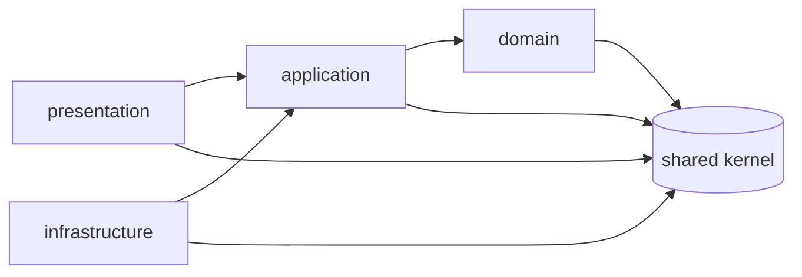

# Arquitectura de VitrinIA

Fuente de las definiciones: [`VITRINIA.md`](../VITRINIA.md) §6–§8. Este documento aterriza esas definiciones en el código y se actualiza con cada PR que toque arquitectura (DoD #9). Cada módulo tendrá su propia página en `modulos/`.

## 1. Vista general

- Una sola app Next.js (App Router) en TypeScript `strict`. Monolito modular con Clean Architecture completa en todos los módulos (ADR-0001).
- Capas por módulo: `domain` → `application` → `infrastructure` / `presentation`. Las dependencias apuntan hacia adentro; el dominio no importa nada externo.
- Multi-tenant por host con triple aislamiento (ADR-0003). Todo caso de uso recibe un `StoreId` del shared kernel.
- Composition root: `src/infra/container.ts` (pendiente; lo crea el módulo que primero lo necesite).



## 2. Shared kernel (`src/shared/kernel/`)

Archivo protegido: solo lo modifica el Architect (AGENTS.md §5). Contiene los tipos base que usan todos los módulos. No importa nada fuera de su carpeta (ni Next, ni Zod, ni Drizzle): es TypeScript puro y se puede ejecutar en cualquier runtime.

Se importa desde el barrel: `import { Money, StoreId, Result } from "@/shared/kernel"`.

| Archivo | Exporta | Para qué |
|---|---|---|
| `result.ts` | `Result<T,E>`, `Ok<T>`, `Err<E>`, `Result.ok/err/isOk/isErr/map/mapErr/andThen/unwrapOr/match/all` | Éxito o fallo explícito, sin excepciones |
| `errors.ts` | `DomainError<Code>`, `domainError()`, `isDomainError()` | Errores de dominio tipados y serializables |
| `money.ts` | `Money`, `Currency`, `CURRENCIES`, `InvalidMoney`, `CurrencyMismatch`, `MoneyError` | Dinero como entero + moneda |
| `store-id.ts` | `StoreId`, `InvalidStoreId` | Identificador de tienda (tenant) con marca de tipo |
| `uuid.ts` | `isUuidV7()` | Validación de UUID v7 reutilizable por otros IDs |

### 2.1 `Result<T, E>`

Unión discriminada `{ ok: true, value } | { ok: false, error }`, congelada con `Object.freeze`. Los casos de uso devuelven `Result` y nunca lanzan excepciones por errores de negocio; las excepciones quedan reservadas para fallos de infraestructura (red, base de datos caída) y se capturan en los adaptadores.

```ts
const total = Result.andThen(price.multiply(qty), (line) => subtotal.add(line));
return Result.match(total, {
  ok: (money) => ({ total: money.toJSON() }),
  err: (error) => ({ error: error.code }),
});
```

- `Result.all([...])` acumula una lista y corta en el primer error (validaciones de carrito, importaciones).
- Se narrowea con `if (!result.ok) return result;` o con `Result.isOk` / `Result.isErr`.

### 2.2 Errores de dominio

Un `DomainError<Code>` es un objeto plano y congelado con `code` (literal, sirve de discriminante en `switch`) y `message` (en inglés, sin datos personales ni entradas del usuario). **No extiende `Error` ni se lanza**: viaja dentro de `Result.err(...)`, cruza server actions sin perder tipo y se puede loggear sin exponer stack traces.

Cada módulo define sus errores extendiendo el tipo con campos propios y una fábrica:

```ts
export type ProductNotFound = DomainError<"ProductNotFound"> & { readonly productId: string };
```

`isDomainError(value)` permite distinguir en los bordes un error de dominio de una excepción inesperada.

### 2.3 `Money`

Decisiones (VITRINIA.md §7, pre-mortem: "diseñar Money con float"):

- `amount` es un **entero seguro** (`Number.isSafeInteger`) en la unidad mínima de la moneda. `CLP` no tiene unidad mínima: `Money.of(1990, "CLP")` son $1.990. `CURRENCIES` registra `minorUnits` por moneda para que agregar una con decimales (si algún día hace falta) no cambie la representación.
- `Money.of(amount, currency)` acepta `currency: string` porque es la puerta de entrada desde filas de base de datos, formularios y JSON; valida y devuelve `Result<Money, InvalidMoney>` con `reason` en `NotAnInteger | OutOfRange | UnknownCurrency`.
- `add`, `subtract` devuelven `Result<Money, MoneyError>`: `CurrencyMismatch` si las monedas difieren (nunca una excepción) e `InvalidMoney` (`OutOfRange`) si el resultado sale del rango seguro.
- `multiply(factor)` solo acepta factores enteros (cantidades). No existe división ni porcentaje en el kernel: el redondeo es una regla de negocio que decidirá el módulo que lo necesite (descuentos, comisiones) con su propio ADR.
- Es inmutable (`Object.freeze`) y el signo está permitido: un `Money` negativo es válido (reembolsos, líneas de ledger). La regla "un precio no es negativo" pertenece al value object `Price` del módulo `catalog`, fuera de este issue.
- `toJSON()` devuelve `{ amount, currency }` y `Money.of` lo vuelve a leer: ese es el contrato de persistencia (columnas `amount` entero + `currency`) y de transporte.
- Formatear como `$1.990` es responsabilidad de la presentación (`Intl.NumberFormat("es-CL")`), no del kernel.

### 2.4 `StoreId`

- Tipo marcado (`string & { [brand]: "StoreId" }`): un `string` suelto no compila donde se espera `StoreId`. Es la pieza que hace verificable la regla "todo caso de uso recibe y comprueba el `StoreId`" (ADR-0003 §5).
- Única forma de obtenerlo: `StoreId.parse(input: unknown)`. Acepta `unknown` para usarse directo en los bordes (sesión, host resuelto, parámetros) y devuelve `Result<StoreId, InvalidStoreId>` si no es un UUID v7 canónico.
- Normaliza a minúsculas para que la igualdad y la comparación en RLS (`app.store_id`) sean canónicas. `StoreId.equals(a, b)` compara por valor.
- El mensaje de `InvalidStoreId` no incluye la entrada recibida: puede venir de un atacante y terminaría en logs.
- La **generación** de IDs no está en el kernel: la hará un puerto `IdGenerator` en infraestructura (Node 22 no trae UUID v7 nativo). Los demás IDs (`ProductId`, `OrderId`...) seguirán el mismo patrón reutilizando `isUuidV7`.

### 2.5 Reglas para quien usa el kernel

1. Nunca `throw` por un error de negocio: devuelve `Result.err(domainError(...))`.
2. Nunca `number` con decimales para dinero: `Money` o nada. Los esquemas Drizzle usan `integer` + `currency`.
3. Nunca `string` para identificar una tienda en dominio o aplicación: `StoreId`.
4. El kernel no crece por conveniencia. Un tipo entra solo si lo usan dos o más módulos y lo aprueba el Architect; lo específico de un módulo vive en su `domain/`.

### 2.6 Verificación

- Tests colocados junto al código (`*.test.ts`) con Vitest; `pnpm test` y `pnpm test:coverage`.
- Umbral de cobertura del 90 % (líneas, ramas, funciones, sentencias) sobre `src/shared/**` y `src/modules/**/{domain,application}/**`, configurado en `vitest.config.mts`. El kernel está al 100 %.
- La regla "el kernel no importa nada externo" la verificará dependency-cruiser (VIT-103); hasta entonces se comprueba con `grep -rn "from \"" src/shared/kernel`.
