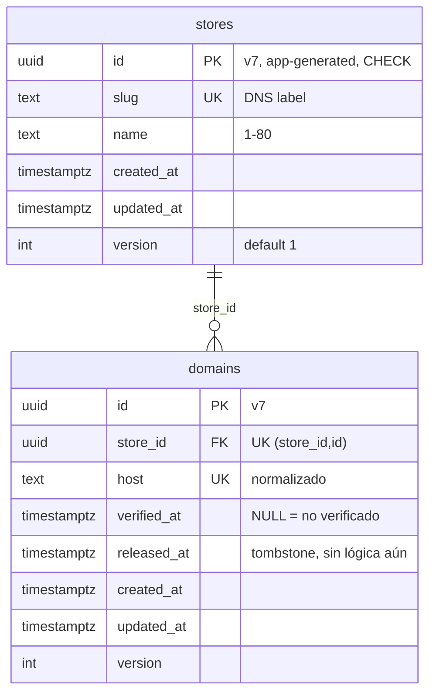
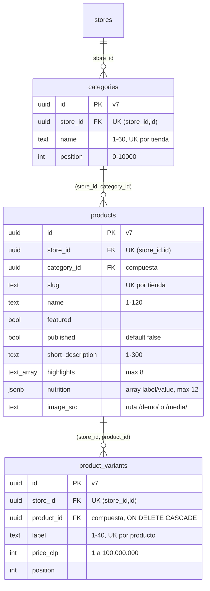

# Modelo de datos

Fuente: esquemas Drizzle en `src/modules/*/infrastructure/schema.ts` y migraciones en `drizzle/migrations/`. Se actualiza a mano hasta que exista `pnpm docs:data-model` (no existe todavía). Convenciones: VITRINIA.md §7 (UUID v7, `timestamptz`, `version`).

## Tenancy (migración 0000_tenancy_base)

| Tabla | Dueño | RLS | Política `app_user` | Grants `app_user` |
|---|---|---|---|---|
| `stores` | migrator | ENABLE + FORCE | `id = NULLIF(current_setting('app.store_id', true), '')::uuid` (USING y WITH CHECK) | SELECT, INSERT, UPDATE |
| `domains` | migrator | ENABLE + FORCE | `store_id = NULLIF(...)::uuid` (USING y WITH CHECK) | SELECT, INSERT, UPDATE, DELETE |

Además `domains_host_resolver` (`FOR SELECT TO host_resolver USING (verified_at IS NOT NULL)`) y la función `resolve_host(text)`; detalle en [`modulos/store-config.md`](modulos/store-config.md).

Restricciones: `id` debe ser UUID v7 (`CHECK`); `domains.host` en minúsculas, sin puerto, sin punto final, sin comodín, ≤ 253 (`CHECK`); `version >= 1`. Índices: PK y únicos (`slug`, `host`, `(store_id, id)`); el último, con `store_id` primero, sirve las consultas por tienda.

## Catálogo (migración 0001_catalog_tables, VIT-183)

| Tabla | Dueño | RLS | Política `app_user` | Grants `app_user` |
|---|---|---|---|---|
| `categories` | migrator | ENABLE + FORCE | `store_id = NULLIF(...)::uuid` (USING y WITH CHECK) | SELECT, INSERT, UPDATE, DELETE |
| `products` | migrator | ENABLE + FORCE | ídem | SELECT, INSERT, UPDATE, DELETE |
| `product_variants` | migrator | ENABLE + FORCE | ídem | SELECT, INSERT, UPDATE, DELETE |

Todas tienen además `created_at`, `updated_at` y `version`. Las FK hijas son compuestas `(store_id, padre_id)` contra el `UNIQUE (store_id, id)` del padre, así una fila nunca apunta a otra tienda aunque una política fallara (C9). Las FK `store_id → stores(id)` están en la sección escrita a mano de la migración porque `stores` es de otro módulo.

Restricciones que también valida la BD (no solo el caso de uso): precio entero en CLP entre 1 y 100 millones (deja los totales de un pedido lejos de 2^31); `image_src` solo como ruta propia bajo `/demo/` o `/media/`, sin `..` ni esquema; imagen completa o ausente (src, alt, ancho y alto juntos); `nutrition` siempre un arreglo JSON. Índices extra: `(store_id, product_id, position)` en variantes y `(store_id, category_id)` en productos.

Solo los productos con `published = true` y al menos una variante llegan a la vitrina (`createDbCatalogReader`). Rollback: `drizzle/rollbacks/0001_catalog_tables.down.sql` (destruye catálogos).
