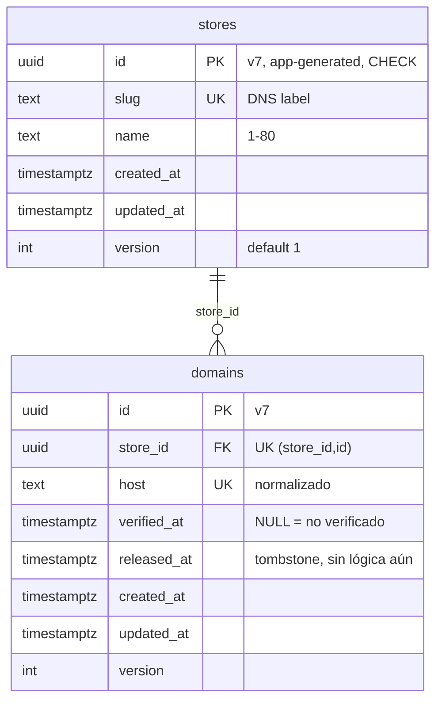
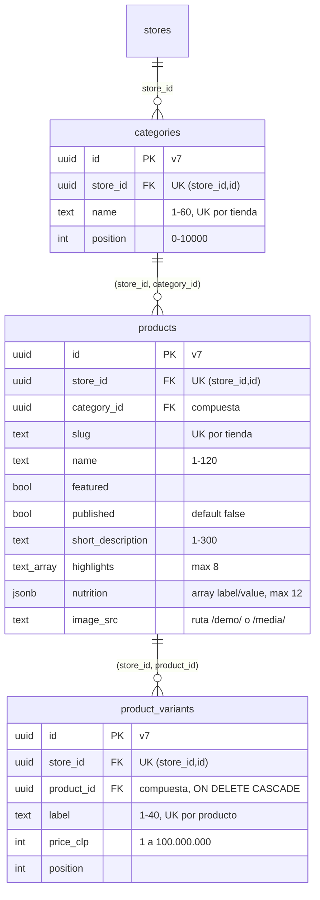
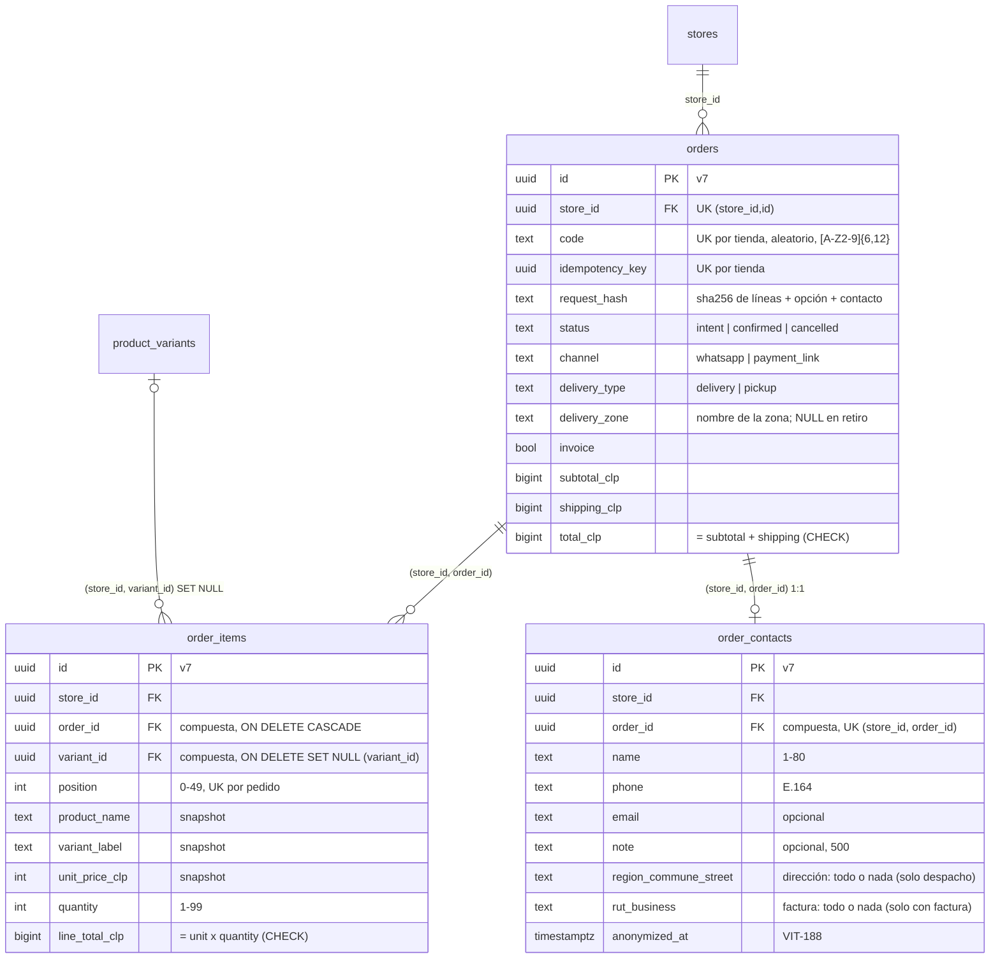

# Modelo de datos

Fuente: esquemas Drizzle en `src/modules/*/infrastructure/schema.ts` y migraciones en `drizzle/migrations/`. Se actualiza a mano hasta que exista `pnpm docs:data-model` (no existe todavía). Convenciones: VITRINIA.md §7 (UUID v7, `timestamptz`, `version`).

## Tenancy (migración 0000_tenancy_base)

| Tabla | Dueño | RLS | Política `app_user` | Grants `app_user` |
|---|---|---|---|---|
| `stores` | migrator | ENABLE + FORCE | `id = NULLIF(current_setting('app.store_id', true), '')::uuid` (USING y WITH CHECK) | SELECT, INSERT, UPDATE |
| `domains` | migrator | ENABLE + FORCE | `store_id = NULLIF(...)::uuid` (USING y WITH CHECK) | SELECT, INSERT, UPDATE, DELETE |

Además `domains_host_resolver` (`FOR SELECT TO host_resolver USING (verified_at IS NOT NULL)`) y la función `resolve_host(text)`; detalle en [`modulos/store-config.md`](modulos/store-config.md).

Restricciones: `id` debe ser UUID v7 (`CHECK`); `domains.host` en minúsculas, sin puerto, sin punto final, sin comodín, ≤ 253 (`CHECK`); `version >= 1`. Índices: PK y únicos (`slug`, `host`, `(store_id, id)`); el último, con `store_id` primero, sirve las consultas por tienda.

## Catálogo (migración 0001_catalog_tables, VIT-183)

| Tabla | Dueño | RLS | Política `app_user` | Grants `app_user` |
|---|---|---|---|---|
| `categories` | migrator | ENABLE + FORCE | `store_id = NULLIF(...)::uuid` (USING y WITH CHECK) | SELECT, INSERT, UPDATE, DELETE |
| `products` | migrator | ENABLE + FORCE | ídem | SELECT, INSERT, UPDATE, DELETE |
| `product_variants` | migrator | ENABLE + FORCE | ídem | SELECT, INSERT, UPDATE, DELETE |

Todas tienen además `created_at`, `updated_at` y `version`. Las FK hijas son compuestas `(store_id, padre_id)` contra el `UNIQUE (store_id, id)` del padre, así una fila nunca apunta a otra tienda aunque una política fallara (C9). Las FK `store_id → stores(id)` están en la sección escrita a mano de la migración porque `stores` es de otro módulo.

Restricciones que también valida la BD (no solo el caso de uso): precio entero en CLP entre 1 y 100 millones (deja los totales de un pedido lejos de 2^31); `image_src` solo como ruta propia bajo `/demo/` o `/media/`, sin `..` ni esquema; imagen completa o ausente (src, alt, ancho y alto juntos); `nutrition` siempre un arreglo JSON. Índices extra: `(store_id, product_id, position)` en variantes y `(store_id, category_id)` en productos.

Solo los productos con `published = true` y al menos una variante llegan a la vitrina (`createDbCatalogReader`). Rollback: `drizzle/rollbacks/0001_catalog_tables.down.sql` (destruye catálogos).

## Pedidos (migración 0002_orders_tables, VIT-186)

| Tabla | RLS | Política `app_user` | Grants `app_user` |
|---|---|---|---|
| `orders` | ENABLE + FORCE | `store_id = NULLIF(...)::uuid` (USING y WITH CHECK) | SELECT, INSERT y `UPDATE (status, version, updated_at)`; nunca montos, código ni opción |
| `order_items` | ENABLE + FORCE | ídem | SELECT, INSERT (snapshot inmutable) |
| `order_contacts` | ENABLE + FORCE | ídem | SELECT, INSERT, UPDATE (la anonimización de VIT-188 lo necesita) |

Ninguna de las tres da `DELETE` a `app_user` (riesgo residual R5 del threat model: el borrado a los 6 años se diseña aparte). `orders` no tiene datos personales legibles; `request_hash` es solo un sha256 (de líneas + opción + contacto limpio; el texto de origen no se guarda ni se loguea), así que no contiene datos personales en claro. Como un teléfono tiene poca entropía, ese hash se podría adivinar por fuerza bruta contra un contacto conocido: la anonimización (VIT-188) debe reemplazarlo junto con `order_contacts`. El contacto del comprador vive solo en `order_contacts`, con los CHECK de largo y de "todo o nada" para dirección y factura. Los montos son `bigint` porque 50 líneas x 99 unidades x 100 millones no caben en `int4`; el caso de uso además rechaza pedidos sobre el tope. Rollback: `drizzle/rollbacks/0002_orders_tables.down.sql` (destruye pedidos y contactos).
