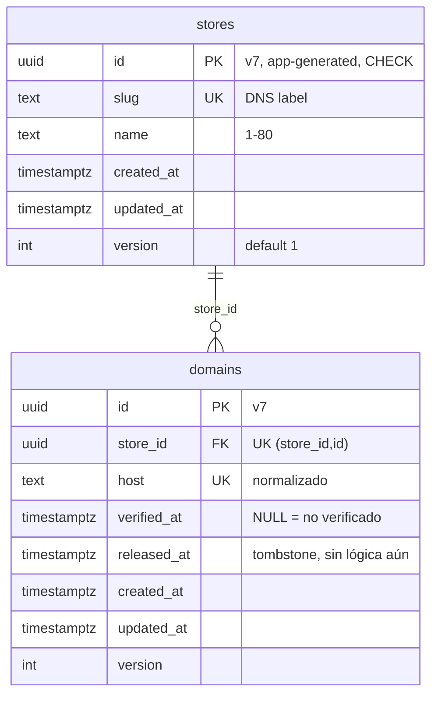

# Modelo de datos

Fuente: esquemas Drizzle en `src/modules/*/infrastructure/schema.ts` y migraciones en `drizzle/migrations/`. Se actualiza a mano hasta que exista `pnpm docs:data-model` (no existe todavía). Convenciones: VITRINIA.md §7 (UUID v7, `timestamptz`, `version`).

## Tenancy (migración 0000_tenancy_base)

| Tabla | Dueño | RLS | Política `app_user` | Grants `app_user` |
|---|---|---|---|---|
| `stores` | migrator | ENABLE + FORCE | `id = NULLIF(current_setting('app.store_id', true), '')::uuid` (USING y WITH CHECK) | SELECT, INSERT, UPDATE |
| `domains` | migrator | ENABLE + FORCE | `store_id = NULLIF(...)::uuid` (USING y WITH CHECK) | SELECT, INSERT, UPDATE, DELETE |

Además `domains_host_resolver` (`FOR SELECT TO host_resolver USING (verified_at IS NOT NULL)`) y la función `resolve_host(text)`; detalle en [`modulos/store-config.md`](modulos/store-config.md).

Restricciones: `id` debe ser UUID v7 (`CHECK`); `domains.host` en minúsculas, sin puerto, sin punto final, sin comodín, ≤ 253 (`CHECK`); `version >= 1`. Índices: PK y únicos (`slug`, `host`, `(store_id, id)`); el último, con `store_id` primero, sirve las consultas por tienda.
