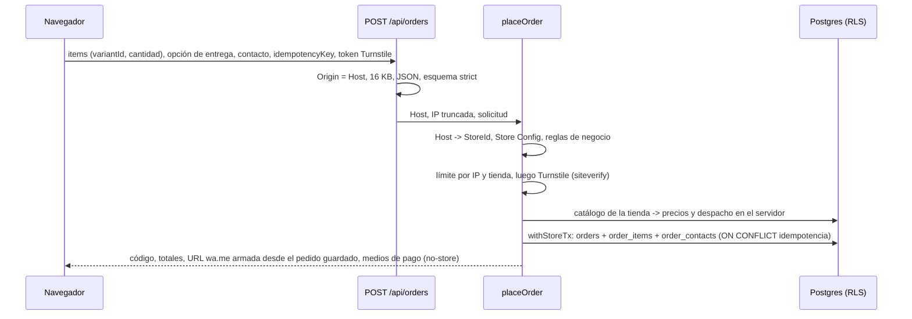

# Módulo orders

Estado: Sprint 2 (VIT-186). El comprador anónimo arma su pedido en la vitrina, el servidor lo recalcula y lo guarda con snapshot, y devuelve el enlace de WhatsApp del vendedor más los medios de pago. Contrato de seguridad: [`threat-models/orders.md`](../../security/threat-models/orders.md) (O1 a O22), ADR-0005 y ADR-0010. Tablas en [`data-model.md`](../data-model.md) (migración 0002).

## Flujo

## Archivos

| Ruta | Qué es |
|---|---|
| `domain/place-order-rules.ts` | `validateOrderRequest` (límites, zona, factura, contacto limpio) y `priceOrder` (precios del catálogo, despacho gratis, tope, huella de idempotencia) |
| `domain/{text,rut,phone,regions,order-code}.ts` | Limpieza de texto (O21), RUT módulo 11, teléfono E.164, regiones, código corto aleatorio (O18) |
| `domain/whatsapp-message.ts` | Mensaje y URL `wa.me` armados desde el pedido guardado (O19, O21) |
| `application/place-order.ts` | Caso de uso; orden: Host, config, validación, límite, Turnstile, catálogo, guardado |
| `application/payment-instructions.ts` | Medios de pago del Store Config, links revalidados contra la allowlist (O20) |
| `application/ports/*` | `OrderRepository`, `HumanVerifier`, `OrderRateLimiter`, `OrderLog` |
| `infrastructure/db-order-repository.ts` | Adaptador Drizzle: una `withStoreTx`, idempotencia con `ON CONFLICT`, reintento de código con savepoint |
| `infrastructure/turnstile-verifier.ts` | Verificación servidor de Cloudflare Turnstile; falla cerrado |
| `infrastructure/memory-order-rate-limiter.ts` | 5 pedidos / 10 min por IP y tienda, 300 / día por tienda (en memoria, riesgo R2) |
| `presentation/http/place-order-handler.ts` | Route handler: Origin, tamaño, esquema Zod strict, mapeo de errores, `Cache-Control: private, no-store` |

## Decisiones

- **Turnstile desde ya** (decisión de Cesar, reemplaza el "no en POC" del threat model P1). Claves públicas de prueba de Cloudflare en development y test (`src/infra/security/turnstile-keys.ts`); `TURNSTILE_SITE_KEY` y `TURNSTILE_SECRET_KEY` son obligatorias en staging y production, y production rechaza la clave secreta de prueba. La verificación es siempre en el servidor. `TURNSTILE_VERIFY_URL` solo existe para el E2E y está prohibida en staging y production.
- **Precios**: la solicitud no trae montos; un cuerpo con `price`, `total`, `storeId`, etc. se rechaza (400). El catálogo se lee con `CatalogReader` (solo productos publicados) y el Store Config con `StoreConfigReader`; no es la misma transacción que el `INSERT` (los módulos no comparten infraestructura). La ventana entre ambas lecturas solo puede dar un precio recién cambiado, nunca uno del cliente.
- **Zona de despacho**: se identifica por el nombre de la zona en el Store Config (único por tienda). Región es una lista cerrada de 16; la comuna es texto libre limpio (el selector de 346 comunas queda pendiente).
- **Sin checkout en el Store Config** (o sin WhatsApp real, o `whatsappCheckout` apagado): `placeOrder` responde igual que un host desconocido y el carrito conserva el enlace simple a WhatsApp.
- **IP del comprador**: `cf-connecting-ip`; si falta, el último salto de `x-forwarded-for`; si falta, un cubo compartido. Siempre truncada (/24, /48). Se endurece con VIT-158.
- **Eventos de analítica** (O15) no entran aquí: no existe todavía la tabla `events`.
