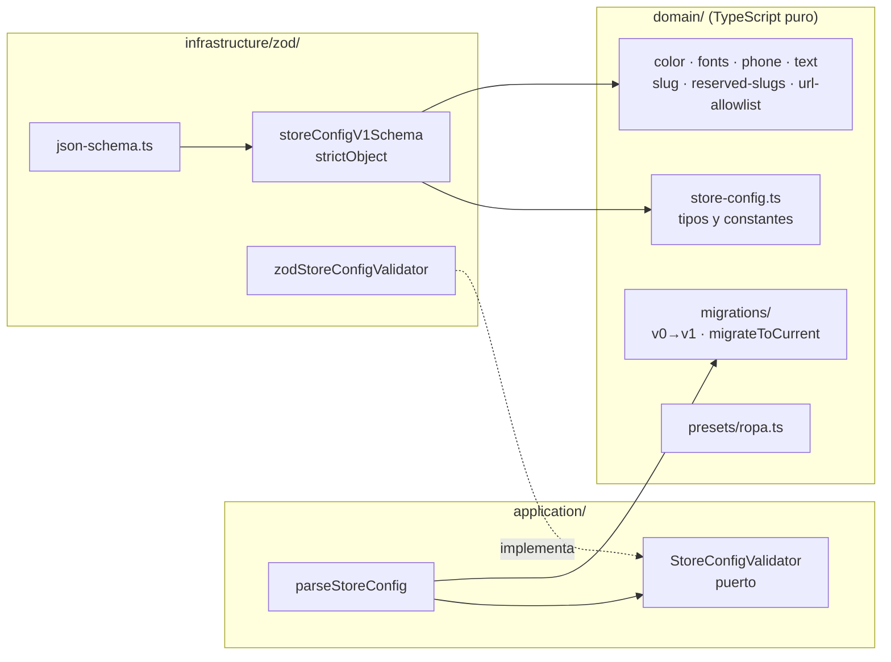

# Módulo store-config

Estado: Sprint 2 (VIT-107, VIT-110, VIT-191). Contiene las tablas raíz de tenancy `stores` y `domains` (VIT-107), el contrato del **Store Config v1** validado con Zod y versionado (VIT-110, ADR-0004 v3) y su **persistencia por tienda** en `store_configs` (VIT-191). Los casos de uso de escritura (portal, con `audit_log`) llegan en Sprint 3. Contrato de seguridad: [`docs/security/threat-models/tenancy.md`](../../security/threat-models/tenancy.md) §5 (C1 a C15) y §9, ADR-0003 y ADR-0004.

## Archivos

| Ruta | Qué es |
|---|---|
| `src/modules/store-config/domain/store-config.ts` | Tipos puros del Store Config v1, `STORE_CONFIG_SCHEMA_VERSION`, lista cerrada de secciones y de feature flags |
| `src/modules/store-config/domain/{color,fonts,phone,text}.ts` | Reglas puras: hex `#rrggbb` y contraste AA (tres pares), fuentes y radios cerrados con su stack CSS, E.164 móvil chileno (+ `PLACEHOLDER_WHATSAPP`), texto plano (`isPlainText`, `isBlankText`) y límites por campo |
| `src/modules/store-config/domain/deep-freeze.ts` | `deepFreeze` para presets (congelamiento profundo) |
| `src/modules/store-config/domain/slug.ts` + `reserved-slugs.ts` | `normalizeSlug` / `validateSlug` y lista reservada (ADR-0004 §8) |
| `src/modules/store-config/domain/url-allowlist.ts` | Allowlist de esquema y host **por campo URL** (ADR-0004 §3) |
| `src/modules/store-config/domain/migrations/` | Cadena `MIGRATIONS` (`vN -> vN+1`, puras) y `migrateToCurrent` |
| `src/modules/store-config/domain/presets/ropa.ts` | `ROPA_PRESET`: Store Config v1 válido del rubro inicial (decisión #10 de Cesar) |
| `src/modules/store-config/application/ports/store-config-validator.ts` | Puerto `StoreConfigValidator` |
| `src/modules/store-config/application/parse-store-config.ts` | `parseStoreConfig(input, validator)`: migrar en memoria → validar |
| `src/modules/store-config/application/index.ts` | Única superficie pública del módulo |
| `src/modules/store-config/infrastructure/zod/store-config-v1.schema.ts` | Esquema Zod `storeConfigV1Schema` (`strictObject` en todos los niveles) |
| `src/modules/store-config/infrastructure/zod/zod-store-config-validator.ts` | Adaptador del puerto (`zodStoreConfigValidator`) |
| `src/modules/store-config/infrastructure/zod/json-schema.ts` | Generador de `docs/arquitectura/store-config.schema.json` (`pnpm docs:store-config-schema`) |
| `tests/fixtures/store-config/v*/` | Fixtures por versión histórica; CI los migra y valida todos |
| `docs/arquitectura/store-config.schema.json` | JSON Schema (draft 2020-12) generado; un test falla si queda desactualizado |
| `src/modules/store-config/infrastructure/schema.ts` | Tablas Drizzle `stores` y `domains` (columnas, checks, únicos) |
| `drizzle/migrations/0000_tenancy_base.sql` | Migración: tablas generadas + sección escrita a mano (RLS, grants, `resolve_host`) |
| `drizzle/rollbacks/0000_tenancy_base.down.sql` | Rollback (destruye datos: en producción, backup + migración correctiva) |
| `src/modules/store-config/infrastructure/db-store-config-reader.ts` | Adaptador Postgres del puerto `StoreConfigReader` (VIT-191): lee la mayor `revision` de la tienda dentro de `withStoreTx` y la pasa por `parseStoreConfig` |
| `drizzle/migrations/0003_store_configs.sql` + `drizzle/rollbacks/0003_store_configs.down.sql` | Tabla `store_configs` con FORCE RLS (política con `USING` y `WITH CHECK`) y su rollback |
| `src/modules/catalog/infrastructure/seed/{kanuwin-config,demo-config-sql}.ts` | Config de Kanuwiñ y generador de `infra/seed/demo-config.sql` (`pnpm demo-config:sql`) |
| `src/infra/db/client.ts` | `createDatabase()`: pool `pg` + Drizzle. Solo con la URL de `app_user` |
| `src/infra/db/with-store-tx.ts` | `withStoreTx(storeId, fn)`: **la única puerta** a tablas de tienda |
| `src/infra/uuid-v7.ts` | `uuidv7()`: generador de ids (el kernel solo valida) |
| `drizzle.config.ts` | Config de drizzle-kit (corre como `migrator`) |
| `tests/integration/tenancy.test.ts` | 51 tests contra Postgres de test, conectados como `app_user` |

## Roles (creados por `infra/docker/postgres/init`)

| Rol | Login | Rol en tenancy |
|---|---|---|
| `migrator` | sí | Dueño de tablas y de `public`; solo lo usa el servicio `migrate`. Sin `BYPASSRLS`/`SUPERUSER`. Es miembro de `host_resolver` solo para poder asignarle la función |
| `app_user` | sí | `app` y `worker`. Sin `BYPASSRLS`, no es dueño de nada. `SELECT/INSERT/UPDATE` en `stores`; `SELECT/INSERT/UPDATE/DELETE` en `domains`; `EXECUTE` en `resolve_host` |
| `host_resolver` | no | Dueño de `resolve_host`. `SELECT (host, store_id, verified_at)` sobre `domains` y política propia `verified_at IS NOT NULL` |

## Cómo se aísla (capa 1, la base de datos)

- `ENABLE` + `FORCE ROW LEVEL SECURITY` en ambas tablas; política `FOR ALL TO app_user` con `USING` y `WITH CHECK` idénticos: `store_id = NULLIF(current_setting('app.store_id', true), '')::uuid` (en `stores` compara `id`).
- Sin contexto: `NULLIF` da `NULL`, la comparación nunca es verdadera, 0 filas (falla cerrado). Con un valor que no es UUID, el cast lanza error: nunca devuelve filas. No hay escape `OR ... IS NULL`.
- `withStoreTx` abre una transacción y ejecuta `select set_config('app.store_id', $1, true)`. El `true` lo hace local a la transacción: `COMMIT` y `ROLLBACK` lo descartan, y el pool no puede entregar la conexión con la tienda anterior. Revalida el `StoreId` con el kernel en tiempo de ejecución y lanza `InvalidStoreContextError` (sin eco del valor) si no es un UUID v7.
- Prohibido fuera del helper: `SET app.store_id`, `set_config(..., false)`, usar el cliente directamente sobre tablas de tienda (reglas Semgrep VIT-105 y dependency-cruiser VIT-103).
- Para crear una tienda nueva el caso de uso llama `withStoreTx(nuevoId, ...)` y inserta `stores` y `domains` dentro: el `WITH CHECK` exige que el contexto coincida con el `id` insertado.

## `resolve_host(host text) returns uuid`

Resuelve host → `StoreId` antes de conocer la tienda (sin contexto). `SECURITY DEFINER`, `STABLE`, `SET search_path = pg_catalog, public`, dueño `host_resolver`, `EXECUTE` revocado de `PUBLIC` y concedido solo a `app_user`. Normaliza (minúsculas, sin puerto, sin punto final, máx. 253, sin comodines). Valida una lista blanca ASCII **antes** de `lower()` porque algunos caracteres Unicode (signo Kelvin) pasan a letras ASCII y suplantarían otro host. Host desconocido, no verificado o mal formado: `NULL` (indistinguibles; la vitrina responde el mismo 404). Devuelve solo el `store_id`. La columna `released_at` (tombstone, VIT-121) existe pero **todavía no tiene lógica** y la función no la consulta.

## Convenciones aplicadas

UUID v7 generado por la app (sin `DEFAULT`; un `CHECK` rechaza otras versiones), `timestamptz`, `version integer not null default 1`, `host` guardado ya normalizado con `CHECK` de formato. `domains` tiene `UNIQUE (store_id, id)` para que las tablas futuras la referencien con FK compuesta `(store_id, id)` (C9). `domains.store_id → stores.id` es FK simple porque `stores` es la raíz y no tiene `store_id`.

## Cómo agregar una tabla de tienda

Sigue `schema-change` y `db-migration`: `store_id uuid not null`, `UNIQUE (store_id, id)`, FK compuestas, índice con `store_id` primero, y en la misma migración `ENABLE`/`FORCE` RLS, política con `USING` y `WITH CHECK` con la expresión de arriba y el `GRANT` mínimo. El arnés de cruce de tiendas (`pnpm test:tenant-isolation`, VIT-109) la enumera solo desde el catálogo y le genera todos los tests; si la tabla tiene FK a otra tabla de tienda o `CHECK` que el seed genérico no puede satisfacer, agrega un seeder en `tests/integration/tenant-isolation/seeders.ts` (ver `docs/qa/tenant-isolation.md`).

## Store Config v1 (VIT-110)

### Dónde vive cada cosa y por qué

- `domain/` y `application/` no importan paquetes (ADR-0008: `domain-is-pure`, `application-only-domain-and-kernel`). Por eso **el esquema Zod es un adaptador de infraestructura** del puerto `StoreConfigValidator`, no un archivo de dominio. Cada regla que Zod aplica delega en una función pura del dominio (`isPlainText`, `meetsAaContrast`, `checkUrlForField`, `CHILEAN_MOBILE_E164_PATTERN`, `FONT_IDS`...), así que el contrato tiene una sola fuente de verdad y se puede testear sin Zod.
- El tipo inferido del esquema se comprueba en compilación contra `StoreConfigV1` del dominio (`store-config-v1.schema.ts`, al final): si divergen, falla `pnpm typecheck`.
- `parseStoreConfig` es la **única entrada** para datos no confiables (fila `jsonb`, seed, formulario, parche MCP): `migrateToCurrent` (puro, en memoria) y luego `validator.validate`. Lectura y escritura pasan por el mismo camino ("dos validaciones por diseño", ADR-0004).
- **`parseStoreConfig` es estricto; la lectura tolerante es de `storefront`.** Cualquier sección, campo o clave inválida hace fallar el parse completo (`Result.err` con todos los `issues`): no existe "omitir lo que no valida" en este módulo. La **lectura tolerante por sección** (omitir la sección que no valida contra el registro de componentes, registrar `store_id`, `page`, índice y `type`, renderizar el resto) la implementa el módulo `storefront` en el Sprint 2 sobre configs ya persistidas (ADR-0004 v3 §2). Hasta entonces no hay lectura tolerante: lo que no pasa `parseStoreConfig` no se persiste y no llega a la vitrina.
- La vitrina obtiene el validador cableado desde `src/infra/container.ts` (lo crea el primer caso de uso que persista, Sprint 2); `presentation/` nunca importa `infrastructure/`.

### Forma del contrato

| Campo | Tipo | Regla |
|---|---|---|
| `schemaVersion` | literal `1` | Otro valor se rechaza; los antiguos se migran antes |
| `identity.name` / `tagline` | texto plano ≤ 80 / ≤ 160 | `isPlainText`: rechaza `\p{Cc}` salvo `\t`/`\n` (incluye C1 como NEL), todo `\p{Cf}` (RLO, ZWSP, BOM, soft hyphen, tags; U+200D ZWJ también, hasta que el Designer pida `ALLOW_ZERO_WIDTH_JOINER`), `\p{Zl}`/`\p{Zp}`, noncharacters y strings mal formados (`isWellFormed()`). `isBlankText`: vacío tras quitar `\p{Cf}`, `\p{Z}` y espacios. `<script>` son caracteres, React escapa |
| `identity.logoImageId` | UUID v7 (`ImageStorage`) | Nunca una URL |
| `theme.colors.{primary,background,text,onPrimary?,accent?}` | `#rrggbb` en minúsculas | Tres pares WCAG 2.x: `text`/`background` ≥ 4.5:1, `primary`/`background` ≥ 3:1 (SC 1.4.11), `onPrimary`/`primary` ≥ 4.5:1. Si `onPrimary` falta, el validador comprueba `DEFAULT_ON_PRIMARY_COLOR` (`#ffffff`) y la vitrina usa ese mismo valor; el validador **no** lo inserta (sin `.transform()`). Se emiten como `--color-*` |
| `theme.font` / `theme.radius` | enum `FONT_IDS` / `RADIUS_IDS` | El valor CSS sale de `FONT_STACKS` / `RADIUS_VALUES` en código, nunca del config |
| `contact.whatsapp` | `+569XXXXXXXX` | La vitrina construye `https://wa.me/<dígitos>`; el host es fijo. `PLACEHOLDER_WHATSAPP` (`+56900000000`) es el número **ficticio** de presets y fixtures: válido en forma para que el preset parsee, nunca se persiste como contacto real (`isPlaceholderWhatsApp` para que seed/onboarding lo afirmen) |
| `contact.paymentLink` | opcional; `https:` + host de la allowlist; **canónico** | `value === new URL(value).href` o `UrlNotAllowed(reason: "not-canonical")`: mayúsculas, `:443`, `%2e`, hosts fullwidth/Unicode, controles, comillas y `<>` se rechazan; el productor serializa, el validador no normaliza. **La allowlist de hosts está vacía: espera la decisión E1 de Cesar** (STATUS.md "Esperando a Cesar" #1). Hoy cualquier valor se rechaza y el campo solo puede estar ausente |
| `pages.home.sections[]` | ≤ 7 de `hero` · `product-grid` · `text` · `whatsapp-cta` | Unión discriminada por `type`; `props` estricto por tipo. Solo `home` en v1; otras páginas se agregan sin migración |
| `features.*` | boolean, claves cerradas (`showPrices`, `showStock`, `whatsappCheckout`, `paymentLinkCheckout`, `search`) | **No son controles de seguridad** (ADR-0004 §9): ninguna validación, aislamiento ni CSP lee una flag. Todas son **obligatorias**: una flag nueva se declara opcional (default resuelto en código) **o** sube `schemaVersion` con migración que la rellene; nunca se agrega a `FEATURE_FLAGS` sin una de las dos |

Todos los objetos son `z.strictObject`: una clave desconocida (incluidas `html`, `css`, `style`, `className`) rechaza la escritura. No hay `z.any`, `z.unknown`, `z.record` ni `.transform()`: lo que entra es lo que se guarda. Los `issues` nunca contienen el valor rechazado ni los nombres de claves desconocidas (`unrecognized_keys` recibe un mensaje fijo y la ruta del objeto): ambos son controlados por el atacante y terminarían en logs.

### Slug

El slug vive en `stores.slug` (VIT-107), no dentro del `jsonb`; las reglas sí viven aquí. `normalizeSlug("Mi Tienda Ñandú")` → `mi-tienda-nandu` es lo que usan el onboarding y el MCP sobre texto libre (NFKC antes de NFD: `ａｐｐ` o `Ⓐdmin` caen en la lista reservada en vez de pasar como "nada sobrevive"); `validateSlug` exige la forma canónica (`[a-z0-9]` con guiones internos simples, 3–40, sin `xn--`, no reservado) y devuelve el candidato normalizado en el error. Lista reservada: `reserved-slugs.ts` (plataforma, auth/infra, marcas y pagos, ofensivas). Renombrar con tombstone y 301 es de VIT-121.

### Versionado

- `STORE_CONFIG_SCHEMA_VERSION = 1`. v0 es la forma plana del prototipo de Sprint 0 (`tests/fixtures/store-config/v0/`); existe para ejercitar la cadena desde el primer día. `migrateV0ToV1` pasa `primaryColor` a minúsculas (v1 solo acepta hex en minúsculas) y descarta el `paymentLink` libre.
- `ROPA_PRESET` está congelado en profundidad (`deepFreeze`): ningún caso de uso ni test puede mutar el estado compartido por una referencia anidada.
- Cambio incompatible: subir la constante, agregar `migrations/vN-to-vN+1.ts` (pura, total, nunca lanza), registrarla en `MIGRATIONS`, crear `tests/fixtures/store-config/vN+1/` y regenerar el JSON Schema. `fixtures.test.ts` falla si falta un eslabón o un fixture.
- `migrateToCurrent` falla cerrado: sin `schemaVersion` entero, versión más nueva que el build, o hueco en la cadena → `UnsupportedSchemaVersion`.
- El job del worker que persiste configs migradas (ADR-0004 §4) y la auditoría de escritura (§7) son de Sprint 2.

### Errores tipados

`InvalidStoreConfig { issues: [{ path, message }] }` (ruta del campo, nunca el valor rechazado), `UnsupportedSchemaVersion`, `InvalidSlug { reason, normalized? }`, `UrlNotAllowed { field, reason }`. Todos viajan en `Result`, nunca se lanzan.

### Pendiente conocido (VIT-110)

- **E1 (Cesar):** hosts permitidos para `contact.paymentLink`. Al decidirse, se llena la fila en `url-allowlist.ts` con revisión de Security; no hace falta subir `schemaVersion`.
- El registro de componentes de `storefront` (Sprint 2) debe cubrir exactamente `SECTION_TYPES`; ese test vive en `storefront`.
- La skill `create-preset` describe `pages.home.sections[]` con `component`/`variant`; el contrato real usa `type`/`props` (ADR-0004 §1). Ajustar la skill (Orchestrator).
- Fuentes: solo stacks de sistema. Agregar una fuente empaquetada es tarea del Designer (id en `FONT_IDS` + archivo self-hosted en `storefront`).

## Store Config en la base de datos (VIT-191)

- **Tabla** `store_configs` (ver `docs/arquitectura/data-model.md`): `config jsonb`, `schema_version`, `revision`; la vitrina sirve la `revision` mayor de la tienda. Entra en el arnés de cruce (`seeders.ts` tiene su seeder porque el `jsonb` debe cumplir el CHECK de forma) y en `tests/integration/store-configs.test.ts`.
- **Lectura** (`createDbStoreConfigReader`): `withStoreTx(storeId)` + filtro explícito por `store_id` + comprobación de que la fila devuelta es de esa tienda; el `jsonb` es **no confiable** y pasa por `parseStoreConfig` (migra en memoria, no reescribe la fila, y valida estricto). Si no parsea (clave desconocida, contraste insuficiente, `schemaVersion` más nueva que el build) devuelve `undefined`: la vitrina responde el mismo 404 sin datos, no hay render parcial ni retroceso a una revisión anterior. El cableado en `container.ts` registra `store_config.invalid` con `storeId` y el código del error, nunca el contenido.
- **Escritura**: hoy solo la semilla local. Todo escritor debe pasar el config por `parseStoreConfig` antes del `INSERT` (misma regla "dos validaciones por diseño").
- **Semilla**: `pnpm db:seed:demo` carga `infra/seed/demo-config.sql` (generado desde `buildKanuwinDemoConfig`, un test falla si queda desactualizado). Es idempotente: con el mismo config no cambia nada; con uno distinto sobrescribe la revisión 1 y sube `version`.
- **Fuera de scope**: edición desde el portal y `audit_log` (Sprint 3).

## Pendiente conocido (tenancy)

- Los seeds de desarrollo deben insertar por tienda dentro de `withStoreTx` (C15); aún no hay seeds.
- `app_user` puede escribir `verified_at` de sus propios dominios: la regla de que un subdominio solo se verifica en el alta y de que los nombres reservados (`app`, `www`, ...) no se pueden reclamar es de los casos de uso (VIT-121).
