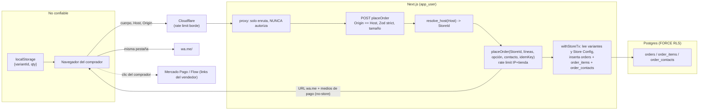

# Threat model: pedidos y checkout (orders) — VIT-186

- Versión: **v1.0** (2026-10-10) · Autor: Security · Estado: **vigente** para construir VIT-186 (Sprint 2). Historial en §8.
- Alcance: el flujo público del comprador desde el carrito (navegador) hasta el pedido guardado (`orders`, `order_items`, `order_contacts`), la redirección a `wa.me` y la pantalla de medios de pago. Incluye las tablas, sus privilegios y lo que el flujo deja en logs y eventos.
- Fuera de alcance: confirmación y panel del vendedor (VIT-127, Sprint 3; extiende este documento), pago integrado y `webhook_inbox` (ADR-0005 §7), edición de medios de pago (portal, Sprint 3; MCP nunca), envío de correos al comprador (no entra en VIT-186; si entra, se extiende este documento antes del código).
- Base: [ADR-0003](../../adr/0003-multi-tenant-por-host-con-rls.md), [ADR-0005](../../adr/0005-checkout-whatsapp-y-link-de-pago.md) §1–5, [ADR-0006](../../adr/0006-analitica-first-party.md), [ADR-0010](../../adr/0010-retencion-de-datos.md); [`VITRINIA.md`](../../VITRINIA.md) §7, §8; [`SECURITY.md`](../SECURITY.md) §3 y §4; [`tenancy.md`](tenancy.md) (C1–C16, que aquí se dan por vigentes y no se repiten). Issues: VIT-186 (#86, dueño), VIT-184 (#84, carrito), VIT-185 (#85, medios de pago y zonas en el Store Config), VIT-126 (#26, logs), VIT-188 (#88, retención).
- Decisiones dadas (no se discuten aquí): carrito en `localStorage` solo con `variantId` y cantidad; `placeOrder` recibe solo `variantId` + cantidad y recalcula todo desde el catálogo de la tienda resuelta por `Host`; despacho (zona) o retiro y factura opcional; contacto en `order_contacts` con FORCE RLS; `order_items` inmutable; idempotencia con clave del cliente; rate limit por IP y tienda; sin login del comprador; el proxy nunca es barrera. Nota: ADR-0005 §1 dice `productId`; VIT-184 lo cambió a variante. Aplica igual.

Principio: **el comprador anónimo solo puede crear un pedido en la tienda del host que visita, con precios que fija el servidor, y nadie distinto del vendedor de esa tienda lee sus datos.**

## 1. Activos

| Activo | Dónde | Sensibilidad | Por qué importa |
|---|---|---|---|
| Contacto del comprador: nombre, teléfono, correo, nota, dirección, RUT/razón social/giro | `order_contacts` | Alta (Ley 21.719) | Fuga entre tiendas, en logs o en eventos es incidente con notificación. |
| Snapshot del pedido: ítems, precio unitario, cantidades, despacho, totales, canal, código corto | `orders`, `order_items` | Media | Base del GMV (Puerta A, inversionistas); si se puede inflar o alterar, la métrica no vale. |
| Volumen de pedidos de una tienda | Secuencia de códigos e IDs | Media | Un competidor que lo deduzca conoce las ventas del vendedor. |
| Medios de pago del vendedor (links MP/Flow, texto de transferencia) y su WhatsApp | Store Config | Alta (integridad) | Un link o número alterado desvía pagos del comprador. |
| URL `wa.me` con el texto del pedido | Respuesta de `placeOrder` (no se persiste) | Media | Contiene datos del comprador; no puede quedar en logs, caché ni historial compartido. |

## 2. Actores

| Actor | Capacidad | Objetivo |
|---|---|---|
| Comprador / visitante anónimo | Controla todo el cuerpo del POST, `localStorage`, headers, `Host`, reintentos | Pagar menos (precio, cantidad negativa, despacho gratis), pedir producto de otra tienda u oculto, falsear el mensaje al vendedor. |
| Bot / spammer | Volumen, IPs rotativas, envío desde otros sitios | Pedidos falsos que inflan GMV o saturan al vendedor; agotar BD; usar el formulario como relay. |
| Vendedor malicioso (tienda B) | Su propia tienda y conocimiento de IDs | Leer pedidos o contactos de A; deducir el volumen de A. |
| Competidor | Hace pedidos de prueba | Enumerar códigos para medir ventas. |
| Código propio equivocado | Builder, worker, logger | Loguear el cuerpo, guardar datos del comprador en el navegador, `storeId` desde el cuerpo. |

## 3. Flujo y fronteras de confianza

Fronteras: (F1) navegador → servidor (todo el cuerpo es hostil); (F2) `Host` → `StoreId`; (F3) caso de uso → BD con RLS; (F4) servidor → logs, Sentry y eventos; (F5) servidor → navegador → terceros (`wa.me`, MP, Flow).

## 4. Amenazas (STRIDE)

Prob. e Impacto B/M/A; clase como en [`tenancy.md`](tenancy.md) §4.

| ID | STRIDE | Amenaza (actor → frontera) | Prob | Imp | Clase | Control | Test |
|---|---|---|---|---|---|---|---|
| T1 | T | Comprador manda precio, nombre, total, costo de despacho o moneda en el cuerpo, o edita `localStorage` (F1). | A | A | Alta | O1, O2 | Unit + integración `placeOrder` |
| T2 | T | Cantidad `0`, negativa, decimal, enorme (overflow del total), `variantId` repetido, 10 000 líneas (F1). | A | M | Alta | O2, O3 | Unit (Zod) + adversarial |
| T3 | I, E | `variantId` de la tienda B, de un producto despublicado/borrado o inexistente; la respuesta distingue los casos (F2, F3). | M | A | Alta | O4, O9 | `tenant-isolation-test` caso de uso + endpoint |
| T4 | T | Zona de despacho de otra tienda o inventada; elegir retiro y mandar dirección, o despacho con zona gratis; factura sin RUT válido (F1). | M | M | Media | O5, O6 | Unit + integración |
| T5 | S, E | `storeId` en el cuerpo o en un header del proxy; `Host` manipulado; tienda no publicada (F2). | M | A | Alta | O7 | Integración + Semgrep G8 |
| T6 | I | Lectura de `order_contacts`/`orders` de otra tienda por código propio sin contexto, FK cruzada o tabla sin FORCE (F3). | M | A | Alta | O8, O9 | Arnés de cruce (automático por catálogo) + `check-rls` |
| T7 | T, R | Modificar el snapshot después de creado (precio, ítems) para inflar o borrar GMV (F3). | B | A | Media | O10 | Integración con `app_user` |
| T8 | D, T | Doble clic, reintento de red o envío concurrente crea pedidos duplicados; misma clave con otro carrito (F1, F3). | A | M | Alta | O11 | Integración concurrente |
| T9 | D | Bot crea miles de pedidos falsos: infla GMV, llena la BD, satura el WhatsApp del vendedor; formulario enviado desde otro sitio (F1). | A | M | Alta | O12, O13 | Integración + E2E |
| T10 | I | Datos del comprador en pino, Sentry, mensajes de error de Zod, `audit_log`, eventos de analítica o `localStorage` (F4). | A | A | Alta | O14, O15, O16 | Test de logs (VIT-126) + test de eventos |
| T11 | I | Respuesta con PII (URL `wa.me`) cacheada por Cloudflare o servida a otro comprador; página de confirmación pública por ID o código (IDOR) (F5). | M | A | Alta | O17, O18 | Integración (headers) + `http.test.ts` |
| T12 | I | Competidor enumera códigos o IDs secuenciales y deduce volumen de ventas de la tienda (F5). | M | M | Media | O18 | Unit (generador) |
| T13 | S, T | Respuesta devuelve un destino que no es el WhatsApp del vendedor ni un medio de pago permitido (open redirect, phishing); link de pago en el Store Config fuera de la allowlist (F5). | B | A | Media | O19, O20 | Unit + adversarial |
| T14 | S, R | Comprador inyecta saltos de línea o caracteres de control en nombre o nota para falsear el mensaje ("Total: $0", "Pagado") o edita el texto en WhatsApp (F5). | A | M | Alta | O21; R1 | Unit del armado del mensaje |
| T15 | I | Contacto conservado más allá de 24 meses o anonimización que deja datos (F3). | M | M | Media | O22 | VIT-188 (fechas simuladas) |
| T16 | R | Comprador niega haber hecho el pedido; vendedor dice que el total era otro. | M | B | Baja | O10 (snapshot con fecha y canal) | — (aceptado, R1) |

Descartadas con motivo: subida de archivos (el checkout no acepta archivos); prompt injection (no hay IA en este flujo; el MCP no crea pedidos ni cambia medios de pago, threat model MCP); cookies de subdominio (el comprador no tiene sesión; el flujo no lee ni emite cookies); abuso de onboarding (otro flujo, VIT-121); datos de tarjeta (nunca se piden, ADR-0005 §5).

## 5. Controles exigidos (criterios de aceptación)

Dueño: Builder en VIT-186 salvo que se indique otro. Cada control nombra su test; los adversariales siguen la skill `adversarial-suite`.

- [ ] **O1 · Precios del servidor.** `placeOrder` acepta solo `variantId`, `quantity`, opción de entrega, contacto e `idempotencyKey`; el esquema Zod es `.strict()`, así que un cuerpo con `price`, `unitPrice`, `total`, `name`, `currency`, `shippingCost` o `storeId` se **rechaza** (400 sin eco de valores). Nombre, precio unitario, `currency`, costo de despacho y totales salen de las variantes y del Store Config leídos dentro de la misma `withStoreTx`. La pantalla de resumen previa al envío se renderiza con precios del servidor, no con los del `localStorage`. *Test:* unit del caso de uso (precio del cuerpo ignorado/rechazado) + integración: carrito con precio editado en `localStorage` → pedido con precio del catálogo.
- [ ] **O2 · Límites numéricos.** `quantity` entero 1..99; 1..50 líneas; `variantId` UUID y sin duplicados (se rechaza, no se suma); total calculado en entero con verificación de `Number.isSafeInteger` y `CHECK` en BD (`quantity > 0`, `unit_price >= 0`, `line_total = unit_price * quantity`, `total = subtotal + shipping`). *Test:* unit adversarial (0, −1, 1.5, 1e9, 51 líneas, duplicado) + integración del `CHECK`.
- [ ] **O3 · Tamaño del cuerpo.** El endpoint rechaza cuerpos > 16 KB antes de parsear; strings con largo máximo (nombre 80, nota 500, calle 120, razón social 120, giro 80, correo 254). *Test:* integración (413/400).
- [ ] **O4 · Solo variantes vendibles de la tienda del host.** Toda variante debe existir en la tienda resuelta, con producto publicado y no archivado; si una línea falla, no se crea nada y la respuesta es la misma (`ITEM_UNAVAILABLE`, sin decir cuál ni por qué) para variante de otra tienda, inexistente o despublicada. *Test:* `tenant-isolation-test` capa caso de uso y endpoint (variante de B desde el host de A → mismo error que UUID aleatorio, 0 filas creadas en A y en B).
- [ ] **O5 · Opción de entrega coherente.** Unión discriminada Zod: `pickup` no admite campos de dirección (cuerpo con dirección → 400); `delivery` exige `zoneId` que exista en el Store Config de **esta** tienda y región/comuna válidas del selector; costo y envío gratis desde un monto se calculan en servidor. *Test:* unit + integración (zona de B, zona inventada, retiro con dirección).
- [ ] **O6 · Factura solo si se pide.** Sin `invoice: true` el esquema rechaza RUT, razón social y giro; con factura, RUT con módulo 11 y formato normalizado. *Test:* unit (RUT inválido, factura ausente con RUT presente).
- [ ] **O7 · Tienda desde el `Host`, nunca del cliente.** `placeOrder` obtiene `StoreId` con `resolve_host` del `Host` en el servidor; no lee `storeId` de cuerpo, query ni headers del proxy (Semgrep G8 ya bloquea headers). Host no verificado, tienda no publicada o sin WhatsApp configurado → 404 idéntico al de host desconocido. *Test:* integración (`storeId` de B en el cuerpo → 400 por `.strict()`; host desconocido vs no publicado → misma respuesta).
- [ ] **O8 · Tablas con RLS y privilegios mínimos.** `orders`, `order_items` y `order_contacts` con `store_id NOT NULL`, `ENABLE` + `FORCE` RLS y política fail-closed de [`tenancy.md`](tenancy.md) C2; las cubre solo el arnés de cruce y `check-rls` (C6). `order_contacts` no tiene columnas de dinero ni de ítems; `orders` no tiene columnas de PII. *Test:* arnés `tenant-isolation` (D1–D6 generados) + `check-rls.sql`.
- [ ] **O9 · FKs compuestas.** `order_items (store_id, order_id) → orders (store_id, id)`, `order_contacts (store_id, order_id) → orders (store_id, id)` (1:1, `UNIQUE (store_id, order_id)`), y la referencia a variante como `(store_id, variant_id)`. *Test:* integración: insertar ítem o contacto con `order_id` de B desde contexto A → rechazo (tenancy C9).
- [ ] **O10 · Snapshot inmutable.** `app_user`: `order_items` solo `SELECT, INSERT`; `orders` `SELECT, INSERT` y `UPDATE` solo en columnas de estado (`status`, `version`, `updated_at`), nunca en montos, ítems ni código; `order_contacts` `SELECT, INSERT, UPDATE` (la anonimización de VIT-188 lo necesita), sin `DELETE`. Ninguna de las tres con `DELETE` para `app_user` en este issue. *Test:* integración como `app_user`: `UPDATE`/`DELETE` en `order_items` y `UPDATE orders SET total` → `permission denied`.
- [ ] **O11 · Idempotencia.** `idempotencyKey` UUID generado con `crypto.randomUUID()` al abrir el checkout; `UNIQUE (store_id, idempotency_key)` en `orders`. Misma clave + mismo contenido → devuelve el mismo pedido (no crea otro); misma clave + contenido distinto (hash de líneas y opción) → 409 sin datos del pedido original. *Test:* integración con 2 y 10 envíos concurrentes (`Promise.all`) → 1 fila; clave reusada con otro carrito → 409; clave de A usada en B → pedido independiente.
- [ ] **O12 · Rate limit y cuota.** Por IP y tienda: 5 pedidos / 10 min; por tienda: 300 pedidos / día (cuota que protege la métrica y la BD). Al exceder: 429 genérico + evento `security.rate_limited` con `store_id` e IP truncada. Los headers `CF-Connecting-IP` / `X-Forwarded-For` se leen **solo** si el entorno declara `TRUSTED_PROXY=cloudflare` (validado al arrancar; lo fija DevOps cuando el origen es alcanzable únicamente vía Cloudflare, VIT-158). Sin esa variable se ignoran y todos comparten un bucket fijo (`unknown`): un cliente directo no puede rotar su bucket falsificando headers, a costa de que el límite por IP sea global hasta activar el flag; la cuota diaria por tienda sigue valiendo. El conteo ocurre **antes** de abrir la transacción. *Test:* integración (6.º envío → 429, sin fila nueva).
- [ ] **O13 · Solo desde la vitrina.** `POST` cuyo `Origin` no coincide con el `Host` → 403 sin efectos (Server Actions lo hacen; si es Route Handler, se verifica explícitamente). *Test:* integración con `Origin` ajeno y sin `Origin`.
- [ ] **O14 · Sin PII en logs ni errores.** Ningún log, excepción ni evento de Sentry de este flujo contiene valores del contacto ni el cuerpo; los errores de Zod se loguean como ruta del campo + código, nunca `received`/`input`; la URL `wa.me` nunca se loguea. *Test:* integración que hace un pedido con centinelas (`comprador-centinela@ejemplo.cl`, `+56900000000`, RUT y calle centinela), fuerza un error de validación y uno de BD, y afirma que la salida capturada de pino y `beforeSend` no contiene ningún centinela (patrón de VIT-126, dueño DevOps del redactor).
- [ ] **O15 · Sin PII en eventos.** `checkout_started`, `order_whatsapp_clicked` y `order_mp_link_clicked` llevan solo `order_id`, total, número de ítems, opción de entrega y canal; su esquema Zod es `.strict()` y no tiene campos libres. *Test:* unit del esquema (propiedad `phone`/`name` → rechazo) + integración: tras un pedido, `events` no contiene centinelas.
- [ ] **O16 · Nada del comprador en el navegador persistente.** `localStorage` guarda solo `{variantId, quantity}` por host; el formulario no persiste nombre, teléfono, dirección ni RUT en `localStorage`/`sessionStorage` (el autocompletado del navegador sí se permite con `autocomplete`). Tras el pedido se vacía el carrito. *Test:* E2E 375 px: después del pedido, `localStorage` y `sessionStorage` sin centinelas.
- [ ] **O17 · Respuesta privada.** La respuesta de `placeOrder` y la pantalla posterior llevan `Cache-Control: private, no-store`; la regla de caché de Cloudflare excluye `POST` y esas rutas (DevOps). *Test:* integración de headers.
- [ ] **O18 · Sin consulta pública de pedidos.** VIT-186 no expone `GET` de pedido por ID ni por código: la pantalla de medios de pago se arma con la respuesta del `POST`. El código corto se genera con `crypto` (≥ 6 caracteres de un alfabeto sin ambiguos, único por tienda, reintento ante colisión), nunca secuencial. *Test:* unit del generador (sin orden, sin correlación con el tiempo) + `http.test.ts`: no hay ruta que devuelva un pedido sin sesión del vendedor.
- [ ] **O19 · Destinos fijados por el servidor.** La URL `https://wa.me/<E.164>` usa el WhatsApp del Store Config (nunca del cliente); el texto va con `encodeURIComponent`. El cliente navega solo si la URL empieza con `https://wa.me/`. *Test:* unit del constructor (número del cliente ignorado) + unit del cliente (URL ajena no navega).
- [ ] **O20 · Medios de pago revalidados al mostrar.** Los links de MP/Flow se vuelven a validar contra la allowlist de VIT-185 (`https:` + host exacto) al renderizar; un link que no pase no se muestra (se loguea `payment_link_rejected` con `store_id`, sin la URL). Se renderizan con `rel="noopener noreferrer"` y sin agregar datos del comprador ni del pedido a la query. La transferencia se muestra como texto escapado por React, nunca `dangerouslySetInnerHTML`. *Test:* unit + adversarial (`http://`, `mercadopago.cl.evil.com`, `javascript:`, userinfo `@`).
- [ ] **O21 · Mensaje de WhatsApp no falsificable por campos de una línea.** Nombre, comuna, calle, razón social y giro se normalizan (NFC) y se les quitan caracteres de control, saltos de línea y marcas bidireccionales; la nota admite saltos pero se coloca al final, en un bloque rotulado "Nota del comprador". El mensaje incluye el código corto y la frase "Verifica el pedido con este código". *Test:* unit del armado (nombre con `\nTotal: $0` → una sola línea).
- [ ] **O22 · Retención conectada.** `order_contacts` tiene `created_at` y `anonymized_at`; VIT-188 anonimiza a los 24 meses todas las columnas de PII (incluidos RUT, razón social y giro: ver P2) bajo `withStoreTx`, de forma idempotente y con registro sin PII. *Test:* en VIT-188 (fechas simuladas en el límite exacto 24 meses ± 1 día).

## 6. Riesgo residual

| ID | Riesgo | Clase | Señal temprana | Aceptado por |
|---|---|---|---|---|
| R1 | Hasta que exista el panel del vendedor (VIT-127, Sprint 3), el vendedor solo ve el texto de WhatsApp, que el comprador puede editar antes de enviarlo (total, ítems). O21 reduce el falseo por campos, no la edición manual. | Media (M/M) | Vendedor reporta diferencia entre lo cobrado y el pedido. | Security, informado a Cesar: el mensaje pide verificar por código y VitrinIA no toca fondos. |
| R2 | Rate limit en memoria de un solo proceso y, mientras el origen sea alcanzable directo (VIT-158), IP falsificable o compartida (sin `TRUSTED_PROXY` los headers se ignoran y hay un solo bucket; con él, se confía en Cloudflare): un bot distribuido puede inflar el GMV de intención hasta la cuota diaria. | Media (M/M) | Picos de pedidos sin `order_whatsapp_clicked`, misma IP truncada en varias tiendas, cuota diaria alcanzada. | Security, condicionado a P1 (Turnstile con gatillo) y a reportar GMV de intención separado del confirmado (ADR-0005 §6). |
| R3 | El comprador queda con la URL `wa.me` (y sus datos) en su historial y en WhatsApp; fuera del control de VitrinIA. Es su propio dato en su dispositivo. | Baja (M/B) | — | Security. |
| R4 | El link de pago puede apuntar a una cuenta que ya no es del vendedor o que él mismo cambió por error; VitrinIA no lo verifica (ADR-0005). Un cambio malicioso exige comprometer el portal (re-verificación, threat model de auth). | Media (B/A) | Cambio de medio de pago en `audit_log` sin login reciente. | Cesar (ADR-0005 §4, 2026-10-08). |
| R5 | El borrado a los 6 años de `orders`/`order_items` no está diseñado: `app_user` no tiene `DELETE`. Hay 6 años de margen. | Baja (B/M) | — | Security; issue de seguimiento para el Architect (rol de retención o borrado en cascada desde `orders`). |

## 7. Supuestos y preguntas para Cesar

- Supuesto: `tenancy.md` C1–C8 y C15 siguen vigentes en `main`; C9 (FKs compuestas), C11 (cruce en caso de uso) y C12 (caché host→tienda) se cumplen en este issue para las tablas de pedidos (O4, O7, O9).
- Supuesto: el comprador no tiene cuenta ni sesión; no hay cookies en este flujo. Si aparece "mis pedidos" o login de comprador, se extiende este documento.
- Supuesto: VIT-186 no envía correo. El correo opcional solo se guarda para que el vendedor lo use. Enviar un resumen desde VitrinIA convierte el formulario en relay de spam y requiere controles nuevos.
- **P1 (Cesar) · Turnstile en el checkout.** VITRINIA.md §8.2 pide Turnstile en flujos públicos; ADR-0005 lo deja "si aparece abuso". **Recomendación:** en la POC, rate limit + cuota diaria + `Origin` (O12, O13), sin Turnstile (evita JS de terceros, cambio de CSP y fricción en la demo); dejar el puerto `HumanVerifier` con adaptador nulo y activarlo con Turnstile antes del piloto público o cuando una tienda supere la cuota diaria dos días seguidos. Si no responde, se aplica esta recomendación.
- **P2 (Cesar) · Plazo de los datos de factura.** ADR-0010 conserva "datos de factura de empresa" 6 años; VIT-188 anonimiza RUT a los 24 meses. Quien factura y guarda el respaldo tributario es el vendedor, no VitrinIA. **Recomendación:** anonimizar RUT, razón social y giro a los 24 meses junto con el resto del contacto (más simple, menos datos, un RUT de persona natural es dato personal) y ajustar la fila de ADR-0010. Si no responde, se aplica esta recomendación y el Architect actualiza ADR-0010.

## 8. Historial

- **v1.0 · 2026-10-10** (VIT-186, antes del código): activos, actores, flujo, 16 amenazas, controles O1–O22, riesgos R1–R5, preguntas P1–P2. Reemplaza la fila pendiente `threat-models/checkout.md` del índice de [`SECURITY.md`](../SECURITY.md) §5.
