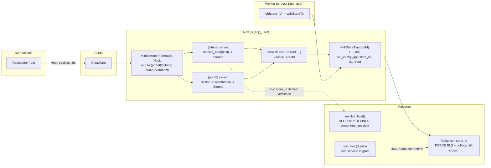

# Threat model: aislamiento entre tiendas (tenancy y RLS) — VIT-108

- Fecha: 2026-10-08 · Autor: Security · Estado: **vigente** (v1, Sprint 1)
- Alcance: la capa de datos y el contexto de tienda que construyen VIT-107 y VIT-109, más los cruces de frontera que ADR-0003 deja diseñados para Sprint 2 y 3 (middleware, caché host→tienda, casos de uso, cookies). Se anota en qué sprint y en qué issue entra cada control que no es de Sprint 1.
- Fuera de alcance: MCP (threat model propio, Sprint 4), Auth.js (Sprint 3), analítica y pedidos (Sprint 2). Cuando toquen tenancy, extienden este documento; no lo reemplazan.
- Base: `docs/VITRINIA.md` §6.1, §7, §8.1, §8.2; ADR-0003 (y 0001, 0004, 0007); `docs/security/pre-mortem-security-2026-10-08.md` (S1, S2); `docs/pre-mortem-2026-10-08.md` (T1, T7, S1, S6); issues VIT-104, 105, 107, 109.

Principio que protege este documento: **un usuario de la tienda A nunca accede a la tienda B.** El "usuario" incluye al vendedor, al comprador, al worker, a la IA del comercio y a cualquier código que se ejecute con credenciales de la app.

## 1. Activos

| Activo | Dónde vive | Sensibilidad | Por qué importa para tenancy |
|---|---|---|---|
| Filas de `stores` y `domains` (Sprint 1); `products`, `orders`, `events`, `store_config`, `audit_log` (Sprint 2+) | Postgres, una sola BD | Alta | Todo dato por tienda. Una fuga es la falla del producto, no un bug. |
| Contexto `app.store_id` | Variable de sesión de Postgres, fijada por transacción | Alta | Es la llave de RLS. Si queda pegada a una conexión, la siguiente request hereda otra tienda. |
| Credenciales `DATABASE_URL` de `app_user` y de `migrator` | `.env.local` cifrado con dotenvx; servicios de compose | Alta (migrator: crítica) | `migrator` es dueño de las tablas; quien lo tenga ve todas las tiendas. |
| Función `resolve_host(host)` (SECURITY DEFINER) | Postgres | Alta | Único punto que lee datos sin contexto de tienda. Si devuelve de más o se puede manipular, rompe la resolución host→tienda. |
| Caché host→tienda en memoria | Proceso Next.js (Sprint 2) | Media | Una entrada vieja o envenenada sirve la tienda equivocada. |
| Cookie de sesión del portal y tokens de magic link | Navegador, `app.vitrinia.cl` (Sprint 3) | Alta | Un host de tienda que reciba la cookie del portal toma la cuenta del vendedor. |
| Datos personales del vendedor (email, WhatsApp) y del comprador (según decisión E2) | `users`, Store Config, `orders` | Alta (Ley 21.719) | Inventario y retención en `docs/security/SECURITY.md`. |
| Entradas de `audit_log` | Postgres, append-only | Media | Evidencia de intentos de cruce; sin ellas no hay detección. |

## 2. Actores

| Actor | Capacidad | Objetivo contra el aislamiento |
|---|---|---|
| Visitante anónimo / comprador | HTTP a cualquier host `*.vitrinia.cl`; controla `Host`, headers, cuerpo, IDs en URLs | Leer catálogo o pedidos de otra tienda; adivinar IDs (UUID v7 son ordenables en el tiempo, no secretos). |
| Vendedor dueño de la tienda A | Sesión válida en el portal; token MCP (Sprint 4) | Normalmente ninguno; su sesión es el activo a proteger. |
| Vendedor malicioso (tienda B) | Igual que A, más tiempo e intención | IDOR, cambiar `storeId` en el cuerpo, usar su cookie contra el host de A, apuntar su subdominio a datos de A. |
| IA del comercio manipulada por contenido del catálogo | Token MCP válido de una tienda | Fuera de alcance aquí (threat model MCP, Sprint 4). Nunca debe poder nombrar otra tienda. |
| Bot / scraper | Volumen; enumeración de hosts e IDs | Enumerar tiendas y productos; agotar conexiones (la transacción por lectura tiene costo). |
| Insider o agente con permisos amplios | `migrator`, acceso al PC de Cesar, dashboard del proveedor gestionado | Leer todo. Se acepta en la POC con límites (riesgo residual R3). |
| Código propio equivocado | Builder, worker, seeds, scripts | El actor más probable: un `SET` sin `LOCAL`, una consulta fuera de `withStoreTx`, una tabla nueva sin política. |

## 3. Flujo y fronteras de confianza

Fronteras que cruza un dato de tienda, en orden: (F1) navegador → Cloudflare → Next.js; (F2) middleware → código de servidor; (F3) servidor → `resolve_host` sin contexto; (F4) caso de uso → `withStoreTx` → RLS; (F5) worker → RLS; (F6) migraciones y seeds → BD como dueño.

## 4. Amenazas (STRIDE)

Prob. e Impacto: B/M/A. Clase: Alta = A/A, A/M, M/A · Media = M/M, A/B, B/A · Baja = resto. Sin relleno: las amenazas descartadas van al final de la sección.

| ID | STRIDE | Amenaza (actor → frontera) | Prob | Imp | Clase | Control | Test |
|---|---|---|---|---|---|---|---|
| A1 | I, E | Código propio ejecuta `SET app.store_id` sin `LOCAL`, `set_config(..., false)` o una consulta fuera de transacción; el pool entrega la conexión con el contexto de A a la request de B (F4). Pooler en modo transacción (Supabase/Neon) agrava: el estado de sesión no es confiable. | M | A | Alta | C3, C4 | Integración: pool de 1 conexión y concurrencia (VIT-107 AC4, AC5); Semgrep (VIT-105 AC5) |
| A2 | E | La app o el worker conectan como dueño de las tablas, superusuario o el rol por defecto del proveedor gestionado; sin `FORCE`, RLS no aplica al dueño (F4, F5). | M | A | Alta | C1, C2 | CI: `pg_roles`/`pg_class` (VIT-105 AC6); compose (VIT-104 AC2, AC4) |
| A3 | I | Tabla nueva con `store_id` (o partición mensual de `events`, Sprint 2) sin `ENABLE`/`FORCE` RLS o sin política; o `GRANT` directo a una partición (F4). | M | A | Alta | C2, C6 | Suite enumera `information_schema`/`pg_class` incluyendo particiones (VIT-109 AC2; VIT-105 AC6) |
| A4 | I | Política abierta con contexto vacío (`... OR current_setting(...) IS NULL`) o `current_setting` sin `missing_ok` que explota y alguien lo "arregla" devolviendo todo (F4). | B | A | Media | C2 | VIT-107 AC1: sin contexto, 0 filas |
| A5 | T | `INSERT`/`UPDATE` que fija `store_id` de B desde una transacción de A (política solo con `USING`, sin `WITH CHECK`) (F4). | M | A | Alta | C5 | Suite de cruce: INSERT/UPDATE con `store_id` ajeno rechazado (VIT-109; ver brecha G1) |
| A6 | S | Host spoofing: `Host` o `X-Forwarded-Host` manipulados, host con puerto, mayúsculas, punto final o `xn--`, subdominio no verificado o desconocido; la vitrina resuelve otra tienda o la caché se envenena (F1, F2, F3). | M | A | Alta | C8, C12 | VIT-107 AC6 + brecha G4 (host no verificado → NULL); Sprint 2: `cache.test.ts` y `http.test.ts` (VIT-120) |
| A7 | E, I | `resolve_host` sobrepermisiva: devuelve más columnas que `store_id`, `search_path` secuestrable, `EXECUTE` a `PUBLIC`, propiedad de un rol con `BYPASSRLS` o del superusuario; se usa para enumerar hosts (F3). | M | M | Media | C8 | Test SQL sobre `pg_proc` (owner, `proconfig` con `search_path`, ACL) y casos host desconocido/no verificado (brecha G4) |
| A8 | E | Un caso de uso toma `storeId` del header que puso el middleware o del cuerpo de la request, en vez de la sesión/host (F2). Antecedente: CVE-2025-29927. | M | A | Alta | C11 | Semgrep "header del middleware en autorización" + tests de caso de uso con sesión A y `StoreId` B (VIT-120, Sprint 2) |
| A9 | I | IDOR: con cookie de A, `GET/PUT/DELETE /api/.../<id de B>`; respuesta 403 revela existencia (F1 → F4). | M | A | Alta | C11, C14 | `http.test.ts`: 404 y entrada en `audit_log` (VIT-120, Sprint 2) |
| A10 | S | Cookie de sesión con `Domain=.vitrinia.cl`, prefijo `__Secure-` (default de Auth.js) o *cookie tossing* desde un subdominio de tienda hacia el portal; `/api/auth/*` respondiendo en hosts de tienda (F1). | B | A | Media | C13 | E2E de atributos de cookie y 404 de `/api/auth/*` fuera del portal (VIT-124, Sprint 3) |
| A11 | T | FK simple `category_id → categories.id` permite que un producto de A apunte a una categoría de B (RLS no valida FKs hacia filas invisibles en todos los casos) (F4). | M | M | Media | C9 | Test de inserción con FK cruzada rechazada (Sprint 2, tablas de catálogo) |
| A12 | E | Worker procesa "todas las tiendas" con un rol con bypass, o un job llega sin `store_id` y se procesa con el contexto anterior (F5). | M | A | Alta | C1, C10 | compose: worker como `app_user` (VIT-104, brecha G7); Sprint 2: job sin `store_id` rechazado (VIT-117) |
| A13 | R | Intentos de cruce no quedan registrados, o los logs registran filas de otra tienda/PII al fallar (F4). | M | M | Media | C14 | Test de redact de pino (VIT-126) y de evento `security.tenant_mismatch` (VIT-120) |
| A14 | T | Tests que pasan en falso: BD vacía, fixture con una sola tienda, conexión de test con `migrator`, test que solo mira códigos HTTP. | M | A | Alta | C5, C7 | Conteo positivo de la propia tienda en cada test; `current_user = 'app_user'` al inicio de la suite (brecha G2) |
| A15 | E, I | `DATABASE_URL` de `migrator` llega al contenedor `app`/`worker` o a `.env.example`; un agente la lee por Bash (`.claude/settings.json` no niega `cat .env*`). | M | A | Alta | C1, C15 | VIT-104 AC2/AC6; VIT-106 AC3/AC5; VIT-116 (settings.json) |
| A16 | D | Lecturas sin índice por `store_id` o transacciones por request agotan el pool; un bot con muchos hosts inválidos fuerza `resolve_host` (F3, F4). | B | M | Baja | Índice que empieza por `store_id` en cada tabla de tienda; `resolve_host` `STABLE` y cacheada; rate limit en Cloudflare | Revisión de esquema en VIT-107; perf-budget en Sprint 2 |
| A17 | I | Enumeración de tiendas por diferencias de respuesta (host no verificado vs inexistente, tiempos). | B | B | Baja | C8: ambos casos devuelven NULL y la vitrina responde el mismo 404 | `http.test.ts` (Sprint 2) |
| A18 | T | Migración ya aplicada editada, o seed que inserta en varias tiendas sin contexto y "funciona" porque corre como `migrator` (F6). | M | M | Media | C15 | CI rechaza diffs en `drizzle/migrations/*` aplicadas (VIT-105); seeds usan `withStoreTx` por tienda |

Descartadas con motivo: subdominio liberado reutilizado por otra tienda (tombstone) va al threat model de onboarding/VIT-121 porque depende del flujo de renombrar, no de RLS; `events` con PII va al threat model de analítica (VIT-125); prompt injection vía catálogo va al threat model MCP (VIT-122): el token MCP se emite por tienda y pasa por `withStoreTx`, así que este documento solo exige que el MCP nunca reciba `storeId` del modelo (C11 aplica igual a tools).

## 5. Controles exigidos (criterios de aceptación)

Cada control es verificable, tiene dueño y test. "Sprint 1" significa que bloquea el merge de VIT-104/105/107/109; los demás bloquean el issue indicado. Las brechas G1–G9 (§6) son controles que hoy no están redactados como criterio en VIT-107/VIT-109.

- [ ] **C1 · Roles y ownership** (DevOps VIT-104 AC2/AC4; DevOps VIT-105 AC6; Sprint 1). `migrator` es dueño de todas las tablas y solo lo usa el servicio `migrate`. `app_user` tiene `NOBYPASSRLS NOSUPERUSER NOCREATEROLE NOCREATEDB`, no es dueño de nada, no es miembro de `pg_read_all_data`/`pg_write_all_data` y solo tiene `GRANT SELECT/INSERT/UPDATE/DELETE` sobre las tablas de aplicación (sin DDL). `migrator` tampoco tiene `BYPASSRLS` (brecha G9). `app` y `worker` reciben únicamente la URL de `app_user`. En el proveedor gestionado (piloto) se crean los mismos dos roles; nunca se usa el rol por defecto del proveedor. Test: consulta a `pg_roles`/`pg_auth_members`/`pg_tables` en CI que falla si se rompe cualquiera de las condiciones.
- [ ] **C2 · RLS fail-closed en toda tabla de tienda** (Builder VIT-107 AC1/AC2; Security VIT-109 AC2; Sprint 1). Toda tabla con `store_id` (`NOT NULL`) tiene `ENABLE` y `FORCE ROW LEVEL SECURITY` y una política `FOR ALL TO app_user USING (store_id = NULLIF(current_setting('app.store_id', true), '')::uuid) WITH CHECK (store_id = NULLIF(current_setting('app.store_id', true), '')::uuid)`. En `stores` la política compara `id`. Las particiones de `events` (Sprint 2) heredan `FORCE` y política, y no reciben `GRANT` directo. Given `app_user` sin contexto When consulta cualquier tabla de tienda Then obtiene 0 filas. Given un valor no UUID en `app.store_id` When consulta Then la política falla con error, no con filas.
- [ ] **C3 · `withStoreTx` es la única puerta** (Builder VIT-107; Architect VIT-103; DevOps VIT-105 AC5; Sprint 1). `withStoreTx(storeId: StoreId, fn)` abre la transacción y ejecuta `select set_config('app.store_id', $1, true)` con un `StoreId` ya validado por el shared kernel (VIT-102); rechaza cualquier otro valor. No existe otro camino para tocar tablas de tienda: Semgrep bloquea `SET app.store_id` sin `LOCAL`, `set_config(..., false)` y `sql.raw` interpolado; dependency-cruiser bloquea importar el cliente Drizzle fuera de `infrastructure/` y de `withStoreTx` (brecha G6). Prohibido `SET` de sesión. Test: regla con fixture positivo/negativo + unit test de `withStoreTx` con `StoreId` inválido (brecha G5).
- [ ] **C4 · Sin fuga por pool** (Builder VIT-107 AC4/AC5; Sprint 1). Given pool de 1 conexión When termina una transacción de A y se consulta sin contexto Then 0 filas. Given transacciones concurrentes de A y B When terminan Then ninguna conexión devuelta conserva `app.store_id`. Given una transacción de A que hace `ROLLBACK` When la siguiente consulta usa la misma conexión Then tampoco hereda contexto.
- [ ] **C5 · Cruce de tiendas en BD, lecturas y escrituras** (Security VIT-109 AC1; Sprint 1). Given `seedTwoStores()` con datos equivalentes When `app_user` con contexto A hace `SELECT`, `UPDATE`, `DELETE` sobre filas de B Then afecta 0 filas; When hace `INSERT` o `UPDATE` fijando `store_id = B` Then la BD rechaza por `WITH CHECK` (brecha G1); y en el mismo test, el conteo de filas propias de A es el esperado (> 0) para probar que la suite no pasa por BD vacía (brecha G2). Cubre conteos y agregados (`count(*)`, `sum`).
- [ ] **C6 · Toda tabla con `store_id` queda cubierta sola** (Security VIT-109 AC2; DevOps VIT-105 AC6; Sprint 1). Given una tabla o partición nueva con `store_id` sin `relrowsecurity`, sin `relforcerowsecurity` o sin política When corre la suite o CI Then falla nombrando la tabla. La enumeración usa `pg_class` con `relkind IN ('r','p')` y recorre `pg_inherits` para particiones (brecha G3).
- [ ] **C7 · Suite honesta y aislada** (Security VIT-109 AC3/AC4; Sprint 1). Corre en CI contra un Postgres efímero, nunca el de desarrollo; se conecta como `app_user` y lo afirma (`select current_user`); una prueba de mutación documentada (quitar la política de `domains`) hace fallar la suite.
- [ ] **C8 · `resolve_host` acotada** (Builder VIT-107 AC6; Sprint 1). Función `resolve_host(host text) RETURNS uuid`, `SECURITY DEFINER`, `STABLE`, con `SET search_path = pg_catalog, public`; propiedad de un rol `host_resolver` (`NOLOGIN`, `NOBYPASSRLS`) que solo tiene `SELECT (host, store_id, verified_at)` sobre `domains` y una política propia `FOR SELECT TO host_resolver USING (verified_at IS NOT NULL)`. `REVOKE EXECUTE ... FROM PUBLIC; GRANT EXECUTE ... TO app_user`. Normaliza la entrada (minúsculas, sin puerto, sin punto final, largo ≤ 253, sin comodines) y devuelve solo `store_id`. Given host desconocido o con `verified_at IS NULL` When se resuelve Then devuelve `NULL` y la vitrina responde 404 idéntico en ambos casos (brecha G4). Ningún rol con `BYPASSRLS` participa.
- [ ] **C9 · FKs compuestas** (Builder, Sprint 2 al crear catálogo y pedidos; verificación en VIT-120). Toda FK entre tablas de tienda es `(store_id, id)`; test de inserción con referencia cruzada rechazada.
- [ ] **C10 · Worker bajo las mismas reglas** (DevOps VIT-104; Builder VIT-117 Sprint 2). El worker conecta como `app_user` (brecha G7: VIT-104 AC4 dice "la app", debe decir "app y worker"). Cada job lleva `store_id`, se re-verifica contra la entidad y se procesa dentro de `withStoreTx`; un job sin `store_id` va a dead-letter.
- [ ] **C11 · El middleware no autoriza; el caso de uso sí** (Security VIT-120 Sprint 2; regla Semgrep en VIT-105, brecha G8). Ningún caso de uso ni tool MCP lee `storeId` de un header del middleware, del cuerpo o de la query sin compararlo con la sesión (portal) o con el host resuelto en el servidor (vitrina). Test parametrizado sobre el listado de casos de uso: sesión de A + `StoreId` de B → `Result.err(NotFound)`, sin efectos, con entrada en `audit_log`. Un caso de uso nuevo sin test de cruce hace fallar la suite.
- [ ] **C12 · Caché host→tienda** (Builder, Sprint 2; test en VIT-120). TTL ≤ 60 s; invalidación explícita desde los casos de uso que renombran, despublican o reasignan; la única fuente del host es el header `Host` tal como lo entrega Cloudflare (`X-Forwarded-Host` se ignora); un host nuevo no hereda la tienda anterior. Tests `cache.test.ts` de la skill `tenant-isolation-test`.
- [ ] **C13 · Cookies amarradas al host** (Builder VIT-124 Sprint 3; headers en VIT-115 Sprint 1). Toda cookie de sesión y CSRF con prefijo `__Host-` (`Secure`, `Path=/`, sin `Domain`); `/api/auth/*` responde 404 fuera de `app.vitrinia.cl`; `AUTH_URL` fijo; en local, `*.localhost` como contexto seguro.
- [ ] **C14 · Cruces visibles, datos invisibles** (DevOps VIT-126 Sprint 2; Builder VIT-120). Todo acceso cruzado responde 404 (nunca 403) y escribe `audit_log` + log `security.tenant_mismatch` con `actor_id`, `store_id` de sesión, `store_id` solicitado y `request_id`; nunca el payload ni filas. Los errores de política RLS y los `app.store_id` vacíos se cuentan como métrica (señal temprana de S1).
- [ ] **C15 · Migraciones y seeds** (Builder VIT-107 AC8; DevOps VIT-105; Sprint 1). Las migraciones corren solo en el servicio `migrate` como `migrator`; una migración aplicada no se edita (CI rechaza el diff); los seeds insertan por tienda dentro de `withStoreTx` o fijando `set_config` por tienda, nunca "como dueño y sin contexto".

## 6. Brechas respecto de VIT-107 y VIT-109

Controles exigidos que no aparecen hoy como criterio de aceptación en ninguno de los dos issues. El Orchestrator los agrega (no se editan desde aquí).

| Brecha | Control | Issue destino | Criterio propuesto |
|---|---|---|---|
| G1 | C5 | VIT-109 | Given contexto A When `INSERT` o `UPDATE` fija `store_id` de B Then la BD rechaza (`WITH CHECK`), además de SELECT/UPDATE/DELETE con 0 filas. |
| G2 | C5, C7 | VIT-109 | Given cada test de cruce When corre Then afirma también el conteo esperado (> 0) de la propia tienda y que `current_user = 'app_user'`. Hoy figura solo como "riesgo", no como criterio. |
| G3 | C6 | VIT-109 | La enumeración de tablas con `store_id` incluye particiones (`relkind IN ('r','p')`, `pg_inherits`) y la tabla `stores` (política por `id`). |
| G4 | C8 | VIT-107 | `resolve_host`: propiedad de `host_resolver` (`NOLOGIN`, `NOBYPASSRLS`) con política propia de solo lectura; `SET search_path`; `EXECUTE` revocado de `PUBLIC`; host desconocido o no verificado → `NULL`; entrada normalizada. |
| G5 | C2, C3 | VIT-107 | `withStoreTx` rechaza un `StoreId` inválido; un valor no UUID en `app.store_id` produce error de política, no filas. |
| G6 | C3 | VIT-107 o VIT-103 | Regla de dependency-cruiser: el cliente Drizzle solo se importa desde `infrastructure/` y las tablas de tienda solo se consultan dentro de `withStoreTx`. VIT-105 AC5 cubre Semgrep, no la regla de capas. |
| G7 | C1, C10 | VIT-104 (fuera de #7/#9, se informa) | AC4 debe decir "la app **y el worker** se conectan como `app_user`". |
| G8 | C11 | VIT-105 o VIT-120 (fuera de #7/#9, se informa) | Regla Semgrep: headers escritos por `middleware.ts` no se usan en decisiones de acceso. |
| G9 | C1 | VIT-107 AC2 o VIT-104 AC2 | `migrator` también sin `BYPASSRLS`/`SUPERUSER`; el chequeo de CI (VIT-105 AC6) revisa ambos roles. |

## 7. Riesgo residual

| ID | Riesgo | Clase | Señal temprana | Aceptado por |
|---|---|---|---|---|
| R1 | Capas 2 y 3 (caso de uso, endpoint, caché, cookies) no existen hasta Sprint 2–3; en Sprint 1 el aislamiento se apoya solo en la BD. Si Sprint 2 construye vitrina sin VIT-120, hay módulos con datos por tienda sin test de cruce de capa. | Media (M/M) | Issue de Sprint 2 con tabla nueva mezclado sin su fila en la matriz capa × caso de `docs/qa/tenant-isolation.md`; VIT-120 fuera del Sprint 2. | Security (con condición: VIT-120 entra al Sprint 2 como P0). |
| R2 | Pooler en modo transacción del proveedor gestionado (piloto) con comportamiento distinto al Postgres local; el test de pool pasa en local y no refleja PgBouncer. | Media (B/A) | Diferencia entre `current_setting('app.store_id', true)` esperado y real en un smoke test contra el proveedor antes del primer deploy; errores de política > 0 en logs. | Security; se re-evalúa en el threat model de deploy (D4). |
| R3 | Insider/agente con credenciales de `migrator` o con acceso al PC de Cesar o al dashboard del proveedor ve todas las tiendas. En la POC no hay separación de ambientes. | Media (B/A) | `migrator` usado fuera del servicio `migrate` (log de conexiones por rol); `.env.keys` fuera de `.gitignore`; hallazgo de gitleaks. | Cesar (datos de todas las tiendas; VITRINIA.md §11.4). Recomendación: aceptar en POC con VIT-106 + VIT-116, y rol de solo lectura auditado antes del piloto. |
| R4 | `resolve_host` es una función con privilegios definidos: un cambio futuro (devolver más columnas, aceptar comodines) reabre A7. | Baja (B/M) | Diff en la función sin `security-review`; test de `pg_proc` en rojo. | Security. |
| R5 | Ad hoc: consultas globales (panel VitrinIA, métricas de inversionistas) tentarán a usar `migrator` o `BYPASSRLS`. | Media (M/M) | Cualquier PR que consulte tablas de tienda sin `withStoreTx`; aparece antes del ADR del rol de solo lectura. | Security; requiere ADR propio (ADR-0003 lo reconoce). |

Riesgos sobre datos sensibles: R3 se escala a Cesar junto con E1–E4 de `docs/STATUS.md`; no bloquea el Sprint 1.

## 8. Supuestos y preguntas abiertas

- Supuesto: UUID v7 no son secretos; la seguridad no depende de que sean difíciles de adivinar (por eso C11 y 404 uniforme).
- Supuesto: en Sprint 1 solo existen `stores` y `domains`; los controles C9–C13 se verifican cuando entren sus tablas y rutas, con este documento como contrato.
- Pregunta (Architect, VIT-107): ¿`domains` guarda el estado de "liberado"/tombstone (`released_at`) desde Sprint 1 para no migrar en Sprint 3 (VIT-121)? Recomendación: sí, columna nullable sin lógica todavía.
- Pregunta (DevOps, VIT-104): ¿`migrator` corre con `log_connections` para la señal temprana de R3? Recomendación: sí en compose; costo cero.
- Pregunta (Cesar, vía STATUS.md): aceptación de R3 en la POC.

## 9. Revisión de ADRs

Veredicto contra "Qué exijo a los ADRs" de `docs/security/pre-mortem-security-2026-10-08.md` y los controles C1–C15. Los ADRs siguen en estado Propuesto, así que el Architect puede incorporar los cambios antes de pasarlos a Aceptado; no se editan desde este issue.

### ADR-0001 Stack técnico — APROBADO

Alcance de esta revisión: stack, infraestructura local y prerrequisitos de tenancy (Postgres con RLS nativo, Drizzle con `set_config` parametrizable, compose con roles separados, Zod en bordes, Semgrep/gitleaks/Renovate desde Sprint 1). Todo lo que exijo para Sprint 1 está cubierto por el ADR o por VIT-104/105/106.
Nota: el threat model de **Auth.js** que el ADR deja pendiente no se cierra aquí; se hace en Sprint 3 con VIT-124 (cookies `__Host-`, `AUTH_URL` fijo, sin vinculación automática de cuentas), antes de que exista código de auth. La aprobación no se extiende a esa parte.

### ADR-0003 Multi-tenant por host con RLS — CAMBIOS REQUERIDOS

El diseño central es correcto y VIT-107 puede empezar con este threat model como contrato; lo que falta es que el ADR deje escritos puntos que hoy solo existen aquí:

1. **Propiedad y límites de `resolve_host`**: rol `host_resolver` (`NOLOGIN`, `NOBYPASSRLS`) con política propia de solo lectura, `search_path` fijo y `EXECUTE` solo para `app_user` (C8). Hoy dice "función `SECURITY DEFINER`" sin decir de quién es; con `FORCE RLS`, si fuera de `migrator` o del superusuario cambia el análisis.
2. **Host no verificado o desconocido → `NULL` → 404 uniforme**, y fuente única del host (`Host` entregado por Cloudflare; `X-Forwarded-Host` ignorado) (C8, C12).
3. **Worker y outbox**: cada job lleva `store_id`, se re-verifica y se procesa dentro de `withStoreTx`; ningún rol del worker salta RLS (C10). El ADR solo dice que usa `app_user`.
4. **Particiones de `events`**: heredan `FORCE` y política; sin `GRANT` directo (C2, C6).
5. **Accesos cruzados devuelven 404 y quedan en `audit_log`** (C14).
6. **Proveedor gestionado**: mismos roles `migrator`/`app_user`, nunca el rol por defecto de Supabase/Neon (C1).
7. **Política con `WITH CHECK`**, no solo `USING` (C5). El texto actual muestra una sola expresión.

### ADR-0004 Tiendas config-driven — CAMBIOS REQUERIDOS

Afecta a tenancy porque el Store Config será escrito por portal y MCP y renderizado en vitrinas públicas. Falta declarar:

1. Esquema `.strict()` con lista de tipos permitidos por campo (VIT-110 AC2 lo tiene; el ADR no).
2. Allowlist de esquema y host **por campo URL** y quién la mantiene (hoy: "https:, sin javascript:/data:"). Para el link de pago depende de E1 (Cesar).
3. Colores y fuentes inyectados por CSS variables desde valores validados, nunca concatenados en `style`/`<style>`.
4. Reglas de slug, lista reservada, tombstone de subdominios renombrados y redirección (VIT-110 AC5 cubre slug; tombstone y redirección no están en ningún ADR).
5. Toda escritura (portal, MCP, migración de `schemaVersion`) deja entrada en `audit_log`.
6. Las feature flags del Store Config no son controles de seguridad.

### ADR-0007 Equipo de 9 agentes — CAMBIOS REQUERIDOS

Las capas de guardrails y el principio "contenido no confiable = datos" están bien. Falta un punto que afecta directamente a este threat model:

1. **Cómo se hace cumplir el veto de Security.** Todos los agentes operan con la misma identidad de GitHub, así que *required reviewers* no sirve. El ADR debe declarar el mecanismo (por ejemplo: check de CI requerido que exige la etiqueta `security-approved` o el bloque `SECURITY REVIEW … VEREDICTO: APROBADO` en PRs que toquen `drizzle/`, `src/middleware.ts`, `src/modules/identity`, `.github/workflows`, `infra/`, o que Cesar sea quien mezcla esos PRs). Sin esto, la capa 3 no cubre la separación de funciones que el ADR promete.
2. Confirmar que VIT-116 (deny de `.env.keys` y `cat .env*` en `.claude/settings.json`) queda como condición de la capa 1, no como mejora opcional.
