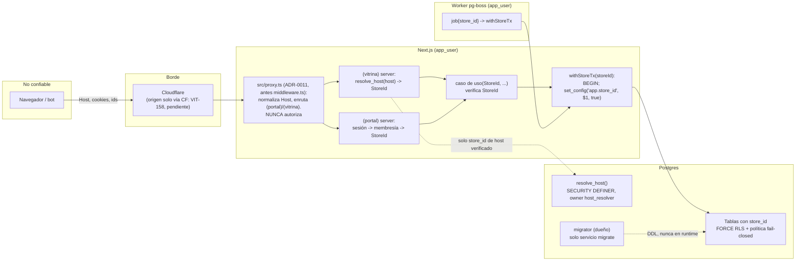

# Threat model: aislamiento entre tiendas (tenancy y RLS) — VIT-108

- Versión: **v1.1** (2026-10-09) · v1.0: 2026-10-07 · Autor: Security · Estado: **vigente** (Sprint 1). Historial en §11.
- Alcance: la capa de datos y el contexto de tienda que construyeron VIT-107 y VIT-109, más los cruces de frontera que [ADR-0003](../../adr/0003-multi-tenant-por-host-con-rls.md) deja diseñados para Sprint 2 y 3 (middleware, caché host→tienda, casos de uso, cookies). Cada control dice si ya está en `main` (con el archivo o test que lo prueba) o en qué issue entra.
- Fuera de alcance: MCP (threat model propio, Sprint 4), Auth.js (Sprint 3), analítica y pedidos (Sprint 2). Cuando toquen tenancy, extienden este documento; no lo reemplazan.
- Base: [`docs/VITRINIA.md`](../../VITRINIA.md) §6.1, §7, §8.1, §8.2; ADR-0003 (y [0001](../../adr/0001-stack-tecnico.md), [0004](../../adr/0004-store-config-driven.md), [0007](../../adr/0007-equipo-de-9-agentes.md), [0008](../../adr/0008-reglas-de-dependencia-con-dependency-cruiser.md), [0009](../../adr/0009-deny-de-lectura-de-secretos-para-agentes.md)); [`pre-mortem-security-2026-10-08.md`](../pre-mortem-security-2026-10-08.md) (S1, S2); [`docs/pre-mortem-2026-10-08.md`](../../pre-mortem-2026-10-08.md) (T1, T7, S1, S6); issues VIT-103, 104, 105, 107, 109 (todos cerrados: PRs #45, #41, #53, #46, #56).
- Evidencia en `main` citada en este documento: [`drizzle/migrations/0000_tenancy_base.sql`](../../../drizzle/migrations/0000_tenancy_base.sql), [`infra/docker/postgres/init/roles.psql`](../../../infra/docker/postgres/init/roles.psql), [`infra/ci/check-rls.sql`](../../../infra/ci/check-rls.sql) y [`rls-check.sh`](../../../infra/ci/rls-check.sh), [`infra/ci/check-migrations-immutable.sh`](../../../infra/ci/check-migrations-immutable.sh), [`src/infra/db/with-store-tx.ts`](../../../src/infra/db/with-store-tx.ts), `tests/integration/tenancy.test.ts`, [`tests/integration/tenant-isolation/db.test.ts`](../../../tests/integration/tenant-isolation/db.test.ts), [`.dependency-cruiser.cjs`](../../../.dependency-cruiser.cjs), [`.semgrep/rules/vitrinia.yml`](../../../.semgrep/rules/vitrinia.yml), [`docker-compose.yml`](../../../docker-compose.yml), [`.claude/settings.json`](../../../.claude/settings.json), [`.github/workflows/ci.yml`](../../../.github/workflows/ci.yml).

Principio que protege este documento: **un usuario de la tienda A nunca accede a la tienda B.** El "usuario" incluye al vendedor, al comprador, al worker, a la IA del comercio y a cualquier código que se ejecute con credenciales de la app.

## 1. Activos

| Activo | Dónde vive | Sensibilidad | Por qué importa para tenancy |
|---|---|---|---|
| Filas de `stores` y `domains` (Sprint 1, en `main`); `products`, `orders`, `order_contacts`, `events`, `store_config`, `audit_log` (Sprint 2+) | Postgres, una sola BD | Alta | Todo dato por tienda. Una fuga es la falla del producto, no un bug. |
| Contexto `app.store_id` | Variable de sesión de Postgres, fijada por transacción | Alta | Es la llave de RLS. Si queda pegada a una conexión, la siguiente request hereda otra tienda. |
| Credenciales `DATABASE_URL` de `app_user` y de `migrator` | Archivos de entorno de desarrollo y de test **sin cifrar**; archivos de staging y producción cifrados con dotenvx, con la clave privada en el archivo de claves (nunca versionado) o en la variable de entorno del proveedor (ADR-0009); servicios de compose | Alta (migrator: crítica) | `migrator` es dueño de las tablas; quien lo tenga ve todas las tiendas. La lectura de esos archivos por agentes está negada en `.claude/settings.json` (fricción, no barrera; C16). |
| Función `resolve_host(host)` (SECURITY DEFINER, dueño `host_resolver`) | Postgres (migración 0000) | Alta | Único punto que lee datos sin contexto de tienda. Si devuelve de más o se puede manipular, rompe la resolución host→tienda. |
| Caché host→tienda en memoria | Proceso Next.js (Sprint 2) | Media | Una entrada vieja o envenenada sirve la tienda equivocada. |
| Cookie de sesión del portal y tokens de magic link | Navegador, `app.vitrinia.cl` (Sprint 3) | Alta | Un host de tienda que reciba la cookie del portal toma la cuenta del vendedor. |
| Datos personales del vendedor (email, WhatsApp, datos de transferencia) y del comprador (`order_contacts`, ADR-0005 §5) | `users`, Store Config, `order_contacts` | Alta (Ley 21.719) | Inventario y retención en [`SECURITY.md`](../SECURITY.md) §3. |
| Entradas de `audit_log` | Postgres, append-only | Media | Evidencia de intentos de cruce; sin ellas no hay detección. |

## 2. Actores

| Actor | Capacidad | Objetivo contra el aislamiento |
|---|---|---|
| Visitante anónimo / comprador | HTTP a cualquier host `*.vitrinia.cl`; controla `Host`, headers, cuerpo, IDs en URLs | Leer catálogo o pedidos de otra tienda; adivinar IDs (UUID v7 son ordenables en el tiempo, no secretos). |
| Vendedor dueño de la tienda A | Sesión válida en el portal; token MCP (Sprint 4) | Normalmente ninguno; su sesión es el activo a proteger. |
| Vendedor malicioso (tienda B) | Igual que A, más tiempo e intención | IDOR, cambiar `storeId` en el cuerpo, usar su cookie contra el host de A, apuntar su subdominio a datos de A. |
| IA del comercio manipulada por contenido del catálogo | Token MCP válido de una tienda | Fuera de alcance aquí (threat model MCP, Sprint 4). Nunca debe poder nombrar otra tienda. |
| Bot / scraper | Volumen; enumeración de hosts e IDs | Enumerar tiendas y productos; agotar conexiones (la transacción por lectura tiene costo). |
| Insider o agente con permisos amplios | `migrator`, acceso al PC de Cesar, dashboard del proveedor gestionado | Leer todo. Aceptado en la POC con límites (riesgo residual R3, Cesar 2026-10-09). |
| Código propio equivocado | Builder, worker, seeds, scripts | El actor más probable: un `SET` sin `LOCAL`, una consulta fuera de `withStoreTx`, una tabla nueva sin política. |

## 3. Flujo y fronteras de confianza

Fronteras que cruza un dato de tienda, en orden: (F1) navegador → Cloudflare → Next.js; (F2) middleware → código de servidor; (F3) servidor → `resolve_host` sin contexto; (F4) caso de uso → `withStoreTx` → RLS; (F5) worker → RLS; (F6) migraciones y seeds → BD como dueño.

## 4. Amenazas (STRIDE)

Prob. e Impacto: B/M/A. Clase: Alta = A/A, A/M, M/A · Media = M/M, A/B, B/A · Baja = resto. Sin relleno: las amenazas descartadas van al final de la sección. La columna "Test" dice qué hay en `main` y qué falta.

| ID | STRIDE | Amenaza (actor → frontera) | Prob | Imp | Clase | Control | Test |
|---|---|---|---|---|---|---|---|
| A1 | I, E | Código propio ejecuta `SET app.store_id` sin `LOCAL`, `set_config(..., false)` o una consulta fuera de transacción; el pool entrega la conexión con el contexto de A a la request de B (F4). Pooler en modo transacción (Supabase/Neon) agrava: el estado de sesión no es confiable. | M | A | Alta | C3, C4 | En `main`: `tenancy.test.ts` "AC4, AC5 and C4" (pool de 1 con `COMMIT`, `ROLLBACK`, alternancia A/B/A, concurrencia); Semgrep `vitrinia-set-store-id-without-local` y `vitrinia-set-config-session-scope`. Endurecimiento: VIT-161. |
| A2 | E | La app o el worker conectan como dueño de las tablas, superusuario o el rol por defecto del proveedor gestionado; sin `FORCE`, RLS no aplica al dueño (F4, F5). | M | A | Alta | C1, C2 | En `main`: `check-rls.sql` pasos 1–3 + autopruebas de `rls-check.sh`; `tenancy.test.ts` "AC2 and G9 catalog"; `docker-compose.yml` (`app` y `worker` con `app_user`). |
| A3 | I | Tabla nueva con `store_id` (o partición mensual de `events`, Sprint 2) sin `ENABLE`/`FORCE` RLS o sin política; partición con `GRANT` directo a `app_user` y sin política propia (**las políticas y los flags de RLS del padre no se heredan**: Postgres evalúa las políticas de la relación nombrada en la consulta) (F4). | M | A | Alta | C2, C6 | En `main`: `check-rls.sql` pasos 4–6 (ENABLE+FORCE en `relkind IN ('r','p')` incluidas particiones; política propia si hay privilegio directo); `db.test.ts` "static (C2/C6/G3)" y mutaciones de `docs/qa/tenant-isolation.md` (partición sin `FORCE` detectada). |
| A4 | I | Política abierta con contexto vacío (`... OR current_setting(...) IS NULL`) o `current_setting` sin `missing_ok` que explota y alguien lo "arregla" devolviendo todo (F4). | B | A | Media | C2 | En `main`: `tenancy.test.ts` "AC1 fail-closed" y "policies are fail-closed … no IS NULL escape"; `check-rls.sql` paso 5b (una política permisiva `USING (true)` junto a una buena abre la tabla y falla); `db.test.ts` S3 exige la expresión exacta. |
| A5 | T | `INSERT`/`UPDATE` que fija `store_id` de B desde una transacción de A (política solo con `USING`, sin `WITH CHECK`) (F4). | M | A | Alta | C5 | En `main`: `db.test.ts` D5/D6 (G1) y `tenancy.test.ts` "INSERT with the store_id of B … rejected by WITH CHECK"; `check-rls.sql` paso 5 exige `WITH CHECK`. |
| A6 | S | Host spoofing: `Host` o `X-Forwarded-Host` manipulados, host con puerto, mayúsculas, punto final, Unicode que colapsa a ASCII (signo Kelvin), subdominio no verificado o desconocido; la vitrina resuelve otra tienda o la caché se envenena (F1, F2, F3). Supuesto: el `Host` llega tal como lo entrega Cloudflare, lo que exige que el origen no sea alcanzable directo (**VIT-158, pendiente**). | M | A | Alta | C8, C12 | En `main`: `tenancy.test.ts` "AC6 and C8/G4" (verificado → id; desconocido y no verificado → `NULL` indistinguibles; Kelvin); Semgrep bloquea `x-forwarded-host`. Sprint 2: `cache.test.ts` y `http.test.ts` (VIT-120); VIT-137 define el rewrite por host. |
| A7 | E, I | `resolve_host` sobrepermisiva: devuelve más columnas que `store_id`, `search_path` secuestrable, `EXECUTE` a `PUBLIC`, propiedad de un rol con `BYPASSRLS` o del superusuario; se usa para enumerar hosts (F3). | M | M | Media | C8 | En `main`: `tenancy.test.ts` "is a bounded SECURITY DEFINER owned by host_resolver", "EXECUTE is revoked from PUBLIC…", "host_resolver can read only host, store_id and verified_at"; `check-rls.sql` pasos 2 y 2b (`host_resolver` sin bypass, `NOLOGIN`). |
| A8 | E | Un caso de uso toma `storeId` del header que puso el middleware o del cuerpo de la request, en vez de la sesión/host (F2). Antecedente: CVE-2025-29927. | M | A | Alta | C11 | En `main`: Semgrep `vitrinia-middleware-header-in-authorization` (G8; ampliación a `$H[$NAME]`, `.has()`, `Object.fromEntries` en VIT-159). Pendiente: tests de caso de uso con sesión A y `StoreId` B (VIT-120, Sprint 2). |
| A9 | I | IDOR: con cookie de A, `GET/PUT/DELETE /api/.../<id de B>`; respuesta 403 revela existencia (F1 → F4). | M | A | Alta | C11, C14 | Pendiente: `http.test.ts` 404 y entrada en `audit_log` (VIT-120, Sprint 2). |
| A10 | S | Cookie de sesión con `Domain=.vitrinia.cl`, prefijo `__Secure-` (default de Auth.js) o *cookie tossing* desde un subdominio de tienda hacia el portal; `/api/auth/*` respondiendo en hosts de tienda (F1). | B | A | Media | C13 | Pendiente: E2E de atributos de cookie y 404 de `/api/auth/*` fuera del portal (VIT-124, Sprint 3). |
| A11 | T | FK simple `category_id → categories.id` permite que un producto de A apunte a una categoría de B (RLS no valida FKs hacia filas invisibles en todos los casos) (F4). | M | M | Media | C9 | En `main` (preparación): `UNIQUE (store_id, id)` en `domains` para FKs compuestas (`tenancy.test.ts` "…(store_id, id) is unique for composite FKs"). Pendiente: test de FK cruzada rechazada al crear catálogo y pedidos (Sprint 2). |
| A12 | E | Worker procesa "todas las tiendas" con un rol con bypass, o un job llega sin `store_id` y se procesa con el contexto anterior (F5). | M | A | Alta | C1, C10 | En `main`: `worker` con `DATABASE_URL` de `app_user` en `docker-compose.yml` (G7). Pendiente: job sin `store_id` a dead-letter (VIT-117, Sprint 2). |
| A13 | R | Intentos de cruce no quedan registrados, o los logs registran filas de otra tienda/PII al fallar (F4). | M | M | Media | C14 | En `main`: `InvalidStoreContextError` omite el valor. Logger pino con redacción y test de `@`/`+569` en `src/infra/logger.ts` (VIT-126). Pendiente: evento `security.tenant_mismatch` (VIT-120). |
| A14 | T | Tests que pasan en falso: BD vacía, fixture con una sola tienda, conexión de test con `migrator`, test que solo mira códigos HTTP. | M | A | Alta | C5, C7 | En `main`: `db.test.ts` "harness honesty (C7/G2)" (`current_user = 'app_user'`, `rolsuper=false`, `rolbypassrls=false` en cada transacción; conteo propio = sembrado > 0); prueba de mutación en CI (`pnpm test:tenant-isolation:mutations`). |
| A15 | E, I | `DATABASE_URL` de `migrator` llega al contenedor `app`/`worker` o a la plantilla de entorno versionada; un agente lee un archivo de entorno sin cifrar o el archivo de claves de dotenvx por Bash o por herramienta y el secreto sale a un PR, un issue, un log o a un tercero por inyección de prompt. | M | A | Alta | C1, C15, **C16** | En `main`: compose da a `app`/`worker` solo la URL de `app_user` (VIT-104, #41); plantilla de entorno sin valores y hook `block-plain-env-files` (VIT-106, #34); reglas `deny`/`ask` de ADR-0009 en `.claude/settings.json` (VIT-116, #72), Security APROBADO en el PR. **Son fricción y tripwire, no barrera** (ADR-0009 §3, ADR-0007 capa 1). Pendiente: matriz del punto 5 de ADR-0009 en una sesión nueva (Security), separación por usuario del SO o sandbox (issue para DevOps, ADR-0009 alternativa 4). |
| A16 | D | Lecturas sin índice por `store_id` o transacciones por request agotan el pool; un bot con muchos hosts inválidos fuerza `resolve_host` (F3, F4). | B | M | Baja | Índice que empieza por `store_id` en cada tabla de tienda; `resolve_host` `STABLE` y cacheada; rate limit en Cloudflare | En `main`: `resolve_host` es `STABLE` y rechaza entradas malformadas antes de consultar. Pendiente: perf-budget en Sprint 2. |
| A17 | I | Enumeración de tiendas por diferencias de respuesta (host no verificado vs inexistente, tiempos). | B | B | Baja | C8: ambos casos devuelven NULL y la vitrina responde el mismo 404 | En `main`: `tenancy.test.ts` "returns NULL for unknown and for unverified hosts, indistinguishably". Pendiente: `http.test.ts` (Sprint 2). |
| A18 | T | Migración ya aplicada editada, o seed que inserta en varias tiendas sin contexto y "funciona" porque corre como `migrator` (F6). | M | M | Media | C15 | En `main`: `check-migrations-immutable.sh` en el job `todo-check` de CI (falla ante diff, rename o borrado de `drizzle/migrations/*.sql`); los seeders del arnés corren como `app_user` dentro de `withStoreTx` (`seeders.ts`). |
| A19 | I | Vista (sin `security_invoker = true`) o tabla foránea con `store_id`, legible por `app_user`, cuyo dueño es `migrator`: salta RLS aunque la tabla base esté protegida (F4). Hueco que A3 no cubre. | B | A | Media | C6 (extensión) | **Pendiente: VIT-164** (Security con QA): `check-rls.sql` y el catálogo del arnés enumeran `relkind IN ('v','f')`. Hoy `check-rls.sql` paso 7 cubre solo matviews. |

Descartadas con motivo: subdominio liberado reutilizado por otra tienda (tombstone) va al threat model de onboarding/VIT-121 porque depende del flujo de renombrar, no de RLS (la columna `released_at` ya existe en `domains`, ADR-0003 v2 y ADR-0004 §8); `events` con PII va al threat model de analítica (VIT-125); prompt injection vía catálogo va al threat model MCP (VIT-122): el token MCP se emite por tienda y pasa por `withStoreTx`, así que este documento solo exige que el MCP nunca reciba `storeId` del modelo (C11 aplica igual a tools).

## 5. Controles exigidos (criterios de aceptación) y su estado

Cada control es verificable, tiene dueño y test. `[x]` = cubierto en `main` al 2026-10-09 con la evidencia indicada; `[ ]` = pendiente, con el issue que lo trae. Las brechas G1–G9 (§6) ya están cerradas.

- [x] **C1 · Roles y ownership** (DevOps VIT-104 #41; DevOps VIT-105 #53; Builder VIT-107 #46). `migrator` es dueño de todas las tablas y solo lo usa el servicio `migrate`. `app_user` tiene `NOBYPASSRLS NOSUPERUSER NOCREATEROLE NOCREATEDB`, no es dueño de nada, no es miembro de `pg_read_all_data`/`pg_write_all_data` y solo tiene `GRANT` mínimo por tabla: `SELECT/INSERT/UPDATE/DELETE` en `domains` y `SELECT/INSERT/UPDATE` (sin `DELETE`) en `stores`; sin DDL, sin privilegio de vaciar tablas ni `REFERENCES`. `migrator` tampoco tiene `BYPASSRLS` (G9). `app` y `worker` reciben únicamente la URL de `app_user`. En el proveedor gestionado (piloto) se crean los mismos roles; nunca se usa el rol por defecto del proveedor. **Evidencia:** `roles.psql`; migración 0000 (`REVOKE ALL … FROM PUBLIC`, `GRANT` por tabla); `check-rls.sql` pasos 1–3 y autopruebas (`app_user`/`migrator`/`host_resolver` con `bypassrls`, superusuario, dueño de tabla); `tenancy.test.ts` "no role used by the system has BYPASSRLS or SUPERUSER (migrator included)", "app_user owns nothing…", "PUBLIC has no privileges…". Pendiente menor: membresía transitiva (`pg_has_role`), VIT-160.
- [x] **C2 · RLS fail-closed en toda tabla de tienda** (Builder VIT-107 #46; Security VIT-109 #56). Toda tabla con `store_id` (`NOT NULL`) tiene `ENABLE` y `FORCE ROW LEVEL SECURITY` y una política `FOR ALL TO app_user USING (store_id = NULLIF(current_setting('app.store_id', true), '')::uuid) WITH CHECK (…misma expresión…)`. En `stores` la política compara `id`. **Particiones** (las de `events` desde Sprint 2): ni los flags de RLS ni las políticas del padre se heredan; cada partición lleva su propio `ENABLE` + `FORCE`, y o bien no recibe `GRANT` directo (solo se consulta por el padre) o tiene su propia política de tienda. Given `app_user` sin contexto When consulta cualquier tabla de tienda Then obtiene 0 filas. Given un valor no UUID en `app.store_id` When consulta Then la política falla con error, no con filas. **Evidencia:** migración 0000; `tenancy.test.ts` "AC1 fail-closed", "G5: invalid tenant values"; `db.test.ts` S1, S3, D2; `check-rls.sql` pasos 4–6.
- [x] **C3 · `withStoreTx` es la única puerta** (Builder VIT-107 #46; Architect VIT-103 #45; DevOps VIT-105 #53). `withStoreTx(storeId: StoreId, fn)` ([`src/infra/db/with-store-tx.ts`](../../../src/infra/db/with-store-tx.ts)) abre la transacción y ejecuta `select set_config('app.store_id', $1, true)` con un `StoreId` que re-valida con `StoreId.parse` aunque el tipo ya lo diga (un cast lo saltaría); cualquier otro valor lanza `InvalidStoreContextError` sin incluir el valor (G5). No existe otro camino para tocar tablas de tienda: Semgrep bloquea `SET app.store_id` sin `LOCAL`, `set_config(..., X)` con `X` distinto del literal `true` y `sql.raw` interpolado; dependency-cruiser bloquea importar `drizzle-orm`/`postgres`/`pg` y `src/infra/db/` fuera de `src/modules/*/infrastructure/` y `src/infra/` (`drizzle-only-in-infrastructure`), y el cliente crudo `src/infra/db/client.ts` fuera de `src/infra/db/` (`db-client-only-via-with-store-tx`) (G6, ADR-0008). Prohibido `SET` de sesión. **Evidencia:** fixtures de Semgrep (`pnpm semgrep:test`) y de dependency-cruiser (`tests/arch/`); `tenancy.test.ts` "G5". Pendiente menor: exigir que `set_config('app.store_id', …)` solo exista en `with-store-tx.ts` (VIT-161).
- [x] **C4 · Sin fuga por pool** (Builder VIT-107 #46). Given pool de 1 conexión When termina una transacción de A y se consulta sin contexto Then 0 filas. Given transacciones concurrentes de A y B When terminan Then ninguna conexión devuelta conserva `app.store_id`. Given una transacción de A que hace `ROLLBACK` When la siguiente consulta usa la misma conexión Then tampoco hereda contexto. **Evidencia:** `tenancy.test.ts` "AC4, AC5 and C4: no tenant context survives in the pool" (4 tests).
- [x] **C5 · Cruce de tiendas en BD, lecturas y escrituras** (Security VIT-109 #56). Given dos tiendas sembradas con datos equivalentes When `app_user` con contexto A hace `SELECT`, `UPDATE`, `DELETE` sobre filas de B Then afecta 0 filas; When hace `INSERT` o `UPDATE` fijando `store_id = B` Then la BD rechaza por `WITH CHECK` (G1); y en el mismo test, el conteo de filas propias de A es el esperado (> 0) (G2). Cubre conteos y agregados (`count(*)`, `count(distinct store_id)`). **Evidencia:** `db.test.ts` D1–D6, generados para cada tabla del catálogo.
- [x] **C6 · Toda tabla con `store_id` queda cubierta sola** (Security VIT-109 #56; DevOps VIT-105 #53). Given una tabla o partición nueva con `store_id` sin `relrowsecurity`, sin `relforcerowsecurity` o sin política When corre la suite o CI Then falla nombrando la tabla. La enumeración usa `pg_class` con `relkind IN ('r','p')`, `pg_inherits` para particiones y la tabla `stores` (G3). **Evidencia:** `catalog.ts` del arnés; `check-rls.sql` pasos 4–6; mutaciones "tabla nueva `notes` sin RLS" y "partición sin FORCE" en `docs/qa/tenant-isolation.md`. Pendiente: vistas y tablas foráneas (VIT-164, A19); comparación explícita `store_id =` en la expresión (VIT-162).
- [x] **C7 · Suite honesta y aislada** (Security VIT-109 #56; DevOps VIT-105 #53). Corre en CI contra un Postgres efímero (service del runner), nunca el de desarrollo; los helpers leen solo `TEST_*`, rechazan hosts no locales y una URL igual a `DATABASE_URL`; se conecta como `app_user` y lo afirma en cada transacción (`current_user`, `rolsuper`, `rolbypassrls`); la prueba de mutación (7 mutaciones más una corrida limpia, incluida la eliminación de la política `domains_tenant`) hace fallar la suite nombrando la tabla. **Evidencia:** `db.test.ts` "harness honesty"; `mutation-check.ts`; job `integration` sin pasos condicionales (`if: hashFiles`). Seguimiento: marcador explícito de BD de test antes de vaciarla (STATUS, "Seguimientos por crear", Builder P2).
- [x] **C8 · `resolve_host` acotada** (Builder VIT-107 #46; DevOps VIT-104 #41 crea el rol). Función `resolve_host(host text) RETURNS uuid`, `SECURITY DEFINER`, `STABLE`, con `SET search_path = pg_catalog, public`; propiedad del rol `host_resolver` (`NOLOGIN`, `NOBYPASSRLS`, creado en `roles.psql`) que solo tiene `SELECT (host, store_id, verified_at)` sobre `domains` y una política propia `FOR SELECT TO host_resolver USING (verified_at IS NOT NULL)`. `REVOKE ALL … FROM PUBLIC; GRANT EXECUTE … TO app_user`. Normaliza la entrada (allowlist ASCII **antes** de `lower()`, minúsculas, sin puerto, sin punto final, largo ≤ 253, formato de hostname) y devuelve solo `store_id`. Given host desconocido, no verificado o malformado When se resuelve Then devuelve `NULL` (G4) y la vitrina responde 404 idéntico (Sprint 2). **Evidencia:** migración 0000; `tenancy.test.ts` "AC6 and C8/G4" (6 tests, incluida la revisión de `pg_proc`); `check-rls.sql` paso 2b.
- [ ] **C9 · FKs compuestas** (Builder, Sprint 2 al crear catálogo y pedidos; verificación en VIT-120). Toda FK entre tablas de tienda es `(store_id, id)`; test de inserción con referencia cruzada rechazada. Preparado en `main`: `UNIQUE (store_id, id)` en `domains`.
- [ ] **C10 · Worker bajo las mismas reglas** (Builder VIT-117, Sprint 2). Parte cubierta: el worker conecta como `app_user` (G7, `docker-compose.yml`). Pendiente: cada job lleva `store_id`, se re-verifica contra la entidad y se procesa dentro de `withStoreTx`; un job sin `store_id` va a dead-letter.
- [ ] **C11 · El middleware no autoriza; el caso de uso sí** (Security VIT-120, Sprint 2). Parte cubierta: regla Semgrep `vitrinia-middleware-header-in-authorization` (G8): leer `x-vitrinia-*`, `x-store-*`, `x-tenant-*`, `x-user-*`, `x-middleware-*` o `x-forwarded-host` en `src/**` fuera de `src/proxy.ts` es error (exclusión actualizada en VIT-181, ADR-0011). Pendiente: test parametrizado sobre el listado de casos de uso: sesión de A + `StoreId` de B → `Result.err(NotFound)`, sin efectos, con entrada en `audit_log`; un caso de uso nuevo sin test de cruce hace fallar la suite. Nota: migrado a `src/proxy.ts` en VIT-181 (ADR-0011); la exclusión de la regla Semgrep ya está actualizada; falta la lista de rutas sensibles de `security-gate` (VIT-149); dependency-cruiser ya contempla ambos nombres (`FRAMEWORK_ENTRY_POINTS`).
- [ ] **C12 · Caché host→tienda** (Builder, Sprint 2; test en VIT-120). TTL ≤ 60 s; invalidación explícita desde los casos de uso que renombran, despublican o reasignan; la única fuente del host es el header `Host` tal como lo entrega Cloudflare (`X-Forwarded-Host` se ignora: Semgrep ya lo bloquea); un host nuevo no hereda la tienda anterior. Depende de VIT-158 (origen solo vía Cloudflare) para que el supuesto sobre `Host` se sostenga. Tests `cache.test.ts` de la skill `tenant-isolation-test`.
- [ ] **C13 · Cookies amarradas al host** (Builder VIT-124, Sprint 3). Parte cubierta: headers y CSP report-only (VIT-115, #42). Pendiente: toda cookie de sesión y CSRF con prefijo `__Host-` (`Secure`, `Path=/`, sin `Domain`); `/api/auth/*` responde 404 fuera de `app.vitrinia.cl`; `AUTH_URL` fijo; en local, `*.localhost` como contexto seguro.
- [ ] **C14 · Cruces visibles, datos invisibles** (DevOps VIT-126, Sprint 2; Builder VIT-120). Todo acceso cruzado responde 404 (nunca 403) y escribe `audit_log` + log `security.tenant_mismatch` con `actor_id`, `store_id` de sesión, `store_id` solicitado y `request_id`; nunca el payload ni filas. Los errores de política RLS y los `app.store_id` vacíos se cuentan como métrica (señal temprana de S1).
- [x] **C15 · Migraciones y seeds** (Builder VIT-107 #46; DevOps VIT-105 #53). Las migraciones corren solo en el servicio `migrate` como `migrator` (compose, perfil `tools`; CI aplica con `pnpm db:migrate` y la URL de `migrator` solo en ese paso); una migración aplicada no se edita (CI rechaza modificación, rename o borrado de `drizzle/migrations/*.sql`); los seeds insertan por tienda dentro de `withStoreTx` como `app_user`, nunca "como dueño y sin contexto". **Evidencia:** `check-migrations-immutable.sh` en el job `todo-check`; `tenancy.test.ts` "AC8: migration applied and recorded"; `seeders.ts` del arnés. Seguimiento: rollback identificado por hash (VIT-151).
- [x] **C16 · Secretos fuera del alcance de los agentes** (Architect VIT-116 #72; ADR-0009; nuevo en v1.1). `.claude/settings.json` niega la lectura, edición y escritura por herramienta del archivo de claves de dotenvx y la lectura de los archivos de entorno sin cifrar (también en subdirectorios), y por Bash cualquier comando que nombre esos archivos como argumento, que nombre la variable de la clave privada, o que invoque los subcomandos de dotenvx que descifran o muestran la clave (también vía `pnpm`/`npx`); `ask` para los archivos cifrados, la plantilla de ejemplo y los volcados del entorno. **Es fricción y tripwire, no barrera** (evadible con globs, comillas o intérpretes; ADR-0009 §3): un intento de evasión es violación de guardrail y se registra en STATUS. La barrera es que el archivo de claves no exista en el checkout de los agentes y que la clave viva en el gestor de Cesar o en la variable de entorno del proveedor. **Evidencia:** `settings.json` en `main` (49 `deny` y 13 `ask` en total; 41 `deny` y 10 `ask` vienen de ADR-0009 v3); Security APROBADO en PR #72. Pendiente: matriz del punto 5 de ADR-0009 (`docs/security/verificaciones/VIT-116-deny-secretos.md`, Security) y separación por usuario del SO o sandbox (DevOps, ADR-0009 alternativa 4).

## 6. Brechas G1–G9: estado

En v1.0 estas brechas eran controles que no figuraban como criterio de aceptación en VIT-107/VIT-109. El Orchestrator las agregó a sus issues el 2026-10-07 (STATUS) y todas están **implementadas y mezcladas**.

| Brecha | Control | Issue real | Estado | PR | Evidencia en `main` |
|---|---|---|---|---|---|
| G1 | C5 | VIT-109 | Cerrada | #56 | `db.test.ts` D5 "INSERT … rejected by WITH CHECK (G1)" y D6 "UPDATE that moves an own row to B"; también `tenancy.test.ts` (VIT-107, #46). |
| G2 | C5, C7 | VIT-109 | Cerrada | #56 | `db.test.ts` `assertAppUser` en cada transacción (`current_user`, `rolsuper`, `rolbypassrls`) y conteo propio = sembrado (> 0). |
| G3 | C6 | VIT-109 + VIT-105 | Cerrada | #56, #53 | `catalog.ts` y `check-rls.sql` con `relkind IN ('r','p')`, `pg_inherits`/`relispartition` y `stores` por `id`. |
| G4 | C8 | VIT-107 | Cerrada | #46 | Migración 0000: `resolve_host` propiedad de `host_resolver` (`NOLOGIN`, `NOBYPASSRLS`, creado en `roles.psql` #41), política propia, `search_path` fijo, `REVOKE … FROM PUBLIC`, normalización; desconocido/no verificado → `NULL`. |
| G5 | C2, C3 | VIT-107 | Cerrada | #46 | `withStoreTx` re-valida con `StoreId.parse` y lanza `InvalidStoreContextError`; `tenancy.test.ts` "a non-UUID app.store_id makes the policy error". |
| G6 | C3 | VIT-103 | Cerrada | #45 | Reglas `drizzle-only-in-infrastructure` y `db-client-only-via-with-store-tx` en `.dependency-cruiser.cjs` (ADR-0008, Aceptado). |
| G7 | C1, C10 | VIT-104 | Cerrada | #41 | `docker-compose.yml`: `worker` con `DATABASE_URL` de `app_user`. |
| G8 | C11 | VIT-105 (+ VIT-159 para ampliar) | Cerrada; ampliación abierta | #53 | Regla Semgrep `vitrinia-middleware-header-in-authorization` con fixtures. VIT-159 agrega `$H[$NAME]`, `.has()` y `Object.fromEntries`. |
| G9 | C1 | VIT-104 + VIT-107 + VIT-105 | Cerrada | #41, #46, #53 | `roles.psql` crea `migrator` con `NOBYPASSRLS NOSUPERUSER`; `tenancy.test.ts` lo afirma; `rls-check.sh` tiene la autoprueba "migrator with BYPASSRLS". |

## 7. Riesgo residual

| ID | Riesgo | Clase | Señal temprana | Aceptado por |
|---|---|---|---|---|
| R1 | Capas 2 y 3 (caso de uso, endpoint, caché, cookies) no existen hasta Sprint 2–3; en Sprint 1 el aislamiento se apoya solo en la BD. Si Sprint 2 construye vitrina sin VIT-120, hay módulos con datos por tienda sin test de cruce de capa. | Media (M/M) | Issue de Sprint 2 con tabla nueva mezclado sin su fila en la matriz capa × caso de [`docs/qa/tenant-isolation.md`](../../qa/tenant-isolation.md); VIT-120 fuera del Sprint 2. | Security (con condición: VIT-120 entra al Sprint 2 como P0; hoy está "Pendiente de Ready"). |
| R2 | Pooler en modo transacción del proveedor gestionado (piloto) con comportamiento distinto al Postgres local; el test de pool pasa en local y no refleja PgBouncer. | Media (B/A) | Diferencia entre `current_setting('app.store_id', true)` esperado y real en un smoke test contra el proveedor antes del primer deploy; errores de política > 0 en logs. | Security; se re-evalúa en el threat model de deploy (D4). |
| R3 | Insider/agente con credenciales de `migrator` o con acceso al PC de Cesar o al dashboard del proveedor ve todas las tiendas. En la POC no hay separación de ambientes. | Media (B/A) | `migrator` usado fuera del servicio `migrate` (`log_connections=on` en compose, vigente); archivo de claves de dotenvx presente en el checkout; hallazgo de gitleaks; un agente que cae en una regla `deny` de ADR-0009. | **Cesar, 2026-10-09** (STATUS, punto 8): aceptado en la POC; rol de solo lectura auditado antes del piloto. Mitigación vigente: VIT-106 (#34) + ADR-0009 (#72) como fricción; pendiente la separación por SO/sandbox (ADR-0009 alt. 4). |
| R4 | `resolve_host` es una función con privilegios definidos: un cambio futuro (devolver más columnas, aceptar comodines) reabre A7. | Baja (B/M) | Diff en la función sin `security-review`; `tenancy.test.ts` "definition review" en rojo. | Security. |
| R5 | Ad hoc: consultas globales (panel VitrinIA, métricas de inversionistas, mantenedor de tiendas de STATUS punto 14) tentarán a usar `migrator` o `BYPASSRLS`. | Media (M/M) | Cualquier PR que consulte tablas de tienda sin `withStoreTx` (dependency-cruiser lo marca); aparece antes del ADR del rol de solo lectura. | Security; requiere ADR propio (ADR-0003 lo reconoce). |
| R6 | Hasta que existan el ruleset de `main` y `security-gate` (VIT-149), el veto de Security y la prohibición de push directo dependen de la disciplina de los agentes y de la mezcla manual de Cesar. | Media (B/A) | Commit en `main` sin PR; PR en zona sensible mezclado sin bloque `SECURITY REVIEW` con head SHA. | Cesar (acción propia, STATUS 11) y DevOps (VIT-149). |

## 8. Supuestos y preguntas

- Supuesto: UUID v7 no son secretos; la seguridad no depende de que sean difíciles de adivinar (por eso C11 y 404 uniforme). La BD exige el formato v7 por `CHECK`.
- Supuesto: en Sprint 1 solo existen `stores` y `domains`; los controles C9–C14 se verifican cuando entren sus tablas y rutas, con este documento como contrato.
- Supuesto: el `Host` que ve Next.js es el que entregó Cloudflare. Hoy no se sostiene (origen alcanzable directo): VIT-158. Mientras tanto el impacto se limita a saltarse el rate limit del borde y a envenenar la caché (que aún no existe), no a cruzar tiendas, porque `resolve_host` solo acepta hosts verificados.
- Resuelta (Architect, VIT-107): `domains.released_at` existe desde la migración 0000 (nullable, sin lógica), como se pidió.
- Resuelta (DevOps, VIT-104): `log_connections=on` en `docker-compose.yml`.
- Resuelta (Cesar, 2026-10-09): aceptación de R3 en la POC (STATUS, punto 8).
- Resuelta (Cesar, 2026-10-09): `middleware.ts` → `proxy.ts` se migra con ADR en el Sprint 2 (VIT-135; rewrite por host en VIT-137). Impacto aquí: C11, G8 y la exclusión de la regla Semgrep nombran `src/middleware.ts`; se actualizan en ese ADR.
- Abierta (Security): ejecutar la matriz del punto 5 de ADR-0009 y guardarla en `docs/security/verificaciones/`.

## 9. Revisión de ADRs

### 9.1 Primera revisión (v1.0, 2026-10-07)

Veredicto contra "Qué exijo a los ADRs" del [pre-mortem de Security](../pre-mortem-security-2026-10-08.md) y los controles C1–C15: ADR-0001 APROBADO; ADR-0003, ADR-0004 y ADR-0007 CAMBIOS REQUERIDOS (7, 6 y 2 puntos respectivamente). Los puntos pedidos quedaron incorporados por el Architect en ADR-0003 v2, ADR-0004 v2 (y v3) y ADR-0007 v2; el detalle de cada punto está en el "Historial" de cada ADR, así que no se repite aquí.

### 9.2 Re-verificación (v1.1, 2026-10-09)

Leída cada versión en `main` contra lo pedido en 9.1.

**ADR-0001 Stack técnico — APROBADO** (sin cambios). La aprobación no cubre Auth.js, que se revisa en Sprint 3 con VIT-124.

**ADR-0003 v2 Multi-tenant por host con RLS — APROBADO, con una corrección no bloqueante.** Los siete puntos están: propiedad y límites de `resolve_host` (decisión 1), host no verificado → `NULL` → 404 uniforme y `Host` como fuente única (1), worker y outbox bajo `withStoreTx` (5), 404 + `audit_log` (5), mismos roles en el proveedor gestionado (3), política con `WITH CHECK` (3), particiones (3). Además incorporó `released_at`. **Corrección pendiente (Architect, P2, issue nuevo):** la decisión 3 dice que las particiones "heredan `FORCE` y la política de la tabla padre". Es incorrecto: en Postgres ni los flags de RLS ni las políticas se heredan; si se consulta la partición directamente, se evalúan sus propias políticas. `check-rls.sql` (pasos 4 y 6) y este documento (C2, A3) ya lo tratan así: `ENABLE` + `FORCE` en cada partición, y política propia si `app_user` tiene privilegio directo. Como el ADR está en Propuesto, se corrige en una v3 sin reemplazarlo. Nota menor: el punto 4 dice "el cliente Drizzle solo se importa desde `infrastructure/`"; la regla real permite `src/modules/*/infrastructure/` y `src/infra/` (donde vive `withStoreTx`). No bloquea.

**ADR-0004 v2/v3 Tiendas config-driven — APROBADO** en lo que pedía 9.1: esquema `.strict()` con tipos por campo (decisión 1), allowlist de esquema y host por campo URL con dueño y en código (3), CSS variables (3), slug, lista reservada, tombstone y redirección (8), `audit_log` en toda escritura (7), feature flags no son controles (9). Los desvíos de la v3 (páginas con nombre, Zod como adaptador, hex en minúsculas, fuentes de sistema, lectura tolerante en `storefront`, pares de contraste) no cambian el análisis de seguridad y Cesar los confirmó el 2026-10-09. Nota para el Architect (no bloquea): la tabla de allowlists dice que `contact.paymentLink` "depende de la decisión E1"; E1 está resuelta (ADR-0005 §4: hosts de Mercado Pago y Flow; transferencia como texto) y conviene reflejarlo al pasar a Aceptado.

**ADR-0007 v2 Equipo de 9 agentes — APROBADO.** El mecanismo del veto (decisión 2: `security-gate`, etiqueta + bloque ligado al head SHA, mezcla por Cesar) y VIT-116 como condición de la capa 1 (decisión 4) están. Las condiciones que el propio ADR deja en "Pendiente para Aceptado" siguen abiertas y no son de Security: `security-gate` (VIT-149, DevOps) y el ruleset de `main` (Cesar). Hasta que existan, el riesgo R6 aplica.

**ADR-0009 v3 Deny de lectura de secretos — APROBADO** por Security en PR #72 (head `bdff5fb`, 2026-10-09), ya mezclado. Para pasar a Aceptado falta la matriz del punto 5 en una sesión nueva (Security, pendiente).

**ADR-0010 Retención de datos — APROBADO** (ver [`SECURITY.md`](../SECURITY.md) §3): los plazos cumplen minimización y finalidad; condición: job diario de retención con test en el issue de `order_contacts` (Sprint 2).

Con esto, ADR-0001, 0003, 0004 y 0007 dejan de esperar a Security. El Architect puede pasarlos a Aceptado cuando cierre sus propios pendientes (corrección de particiones en 0003; allowlist de pago en 0004; `security-gate` y ruleset en 0007).

## 10. Seguimientos relacionados (fuera de este documento)

| Issue | Qué cubre | Relación con este modelo |
|---|---|---|
| VIT-120 | Tests de cruce en caso de uso y endpoint (Sprint 2, P0 para Security) | C9, C11, C12, C14; A8, A9, A13, A17 |
| VIT-149 | Check `security-gate` | Veto de Security; R6 |
| VIT-158 | Origen alcanzable solo vía Cloudflare | Supuesto de A6 y C12 |
| VIT-164 | Vistas y tablas foráneas con `store_id` en arnés y `check-rls` | A19; extensión de C6 |
| VIT-160, VIT-162 | `check-rls`: membresía con `pg_has_role`; `store_id =` en la expresión | Endurecen C1 y C6 |
| VIT-161 | Semgrep: `set_config` solo dentro de `withStoreTx`; `.mts/.cts/.jsx` | Endurece C3 |
| VIT-159 | Semgrep: ampliar G8 y fijar packs | Endurece C11 |
| VIT-135, VIT-137 | `middleware.ts` → `proxy.ts` (ADR en Sprint 2); rewrite por host | C11, G8, rutas de `security-gate` |
| VIT-117 | Outbox idempotente, dead-letter | C10 |
| VIT-124 | Auth.js en `app.vitrinia.cl` con `__Host-` | C13, A10 |
| VIT-126 | pino con redacción | C14, A13 |
| VIT-152 | CSP enforce; fusión de `headers.md` en `SECURITY.md` | Contexto de C13 |
| VIT-151 | Rollback de migraciones por hash | C15 |
| Por crear (STATUS "Seguimientos por crear") | `order_contacts` con RLS + checkout por opción + job de retención (Builder + Security, P1, Sprint 2); marcador de BD de test antes de vaciarla (Builder, P2) | Threat model de checkout; C7 |
| Por crear (Architect, P2) | Corregir ADR-0003 decisión 3: las particiones no heredan flags ni políticas de RLS | §9.2 |

## 11. Historial

- **v1.1 · 2026-10-09** (PR #39, hallazgos del Reviewer): estado de cada control con evidencia en `main`; brechas G1–G9 con issue real, PR y evidencia; corrección de particiones (C2, A3: no heredan flags ni políticas); A15 y activos alineados con ADR-0009 (fricción, no barrera) y nuevo C16; R3 aceptado por Cesar, `released_at` y `log_connections` resueltos; nueva A19 (vistas y tablas foráneas, VIT-164) y R6 (ruleset y `security-gate` pendientes); supuesto de Cloudflare ligado a VIT-158; `middleware.ts` → `proxy.ts` (VIT-135/137); §9 con la re-verificación de ADR-0003 v2, 0004 v2/v3, 0007 v2 y veredictos de 0009 y 0010; §10 con seguimientos; rutas reales (`src/infra/db/`), `app_user` sin `DELETE` en `stores`, links Markdown.
- **v1.0 · 2026-10-07** (registrado en STATUS ese día; el documento decía 2026-10-08): activos, actores, fronteras, 18 amenazas, 15 controles, brechas G1–G9, riesgo residual R1–R5, preguntas abiertas y primera revisión de ADR-0001/0003/0004/0007.
